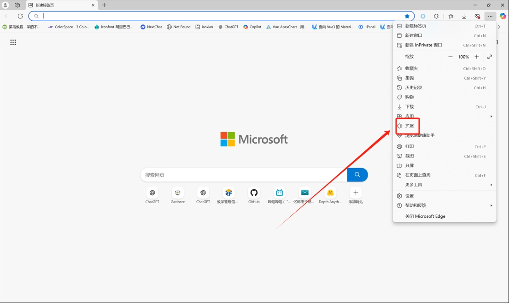
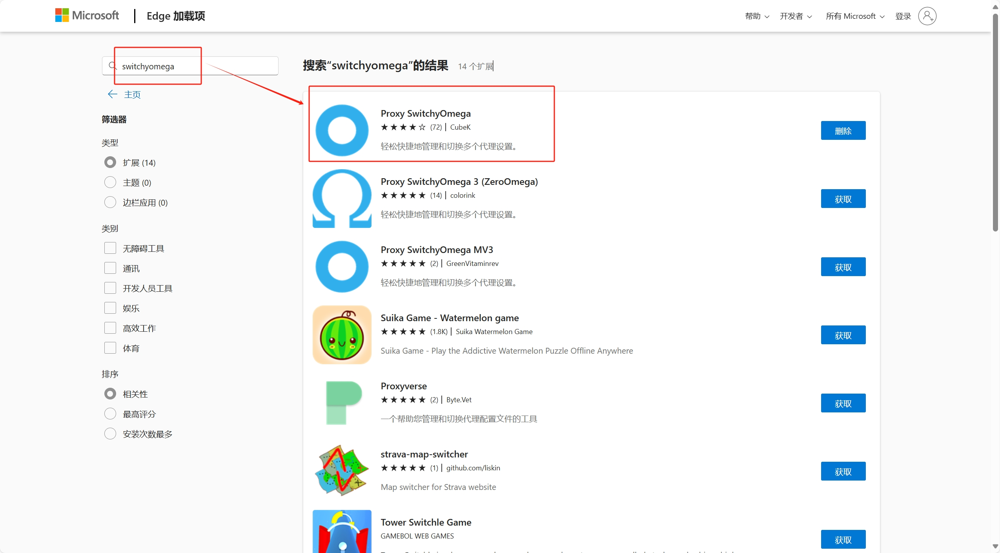
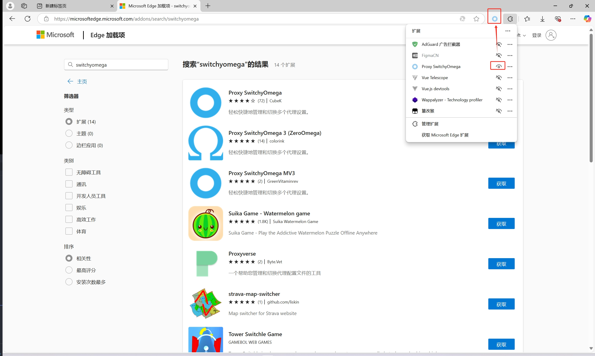
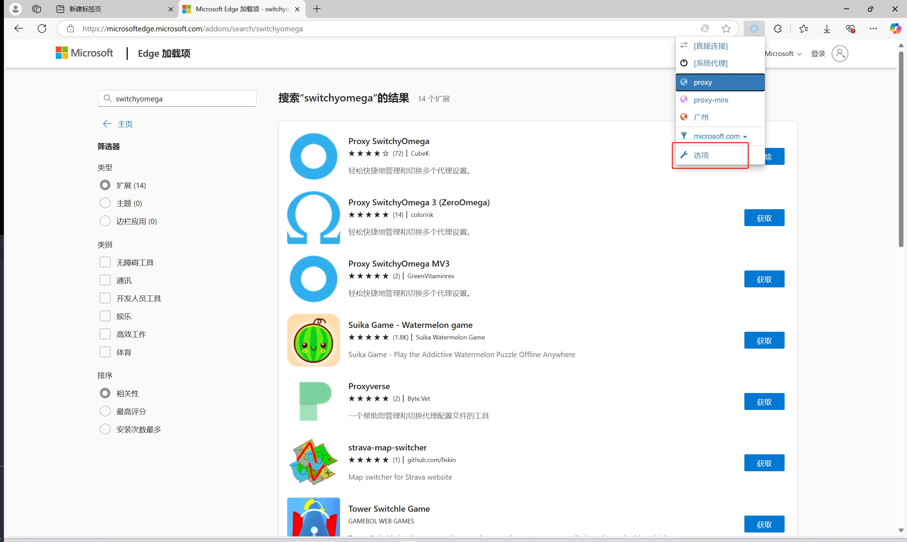
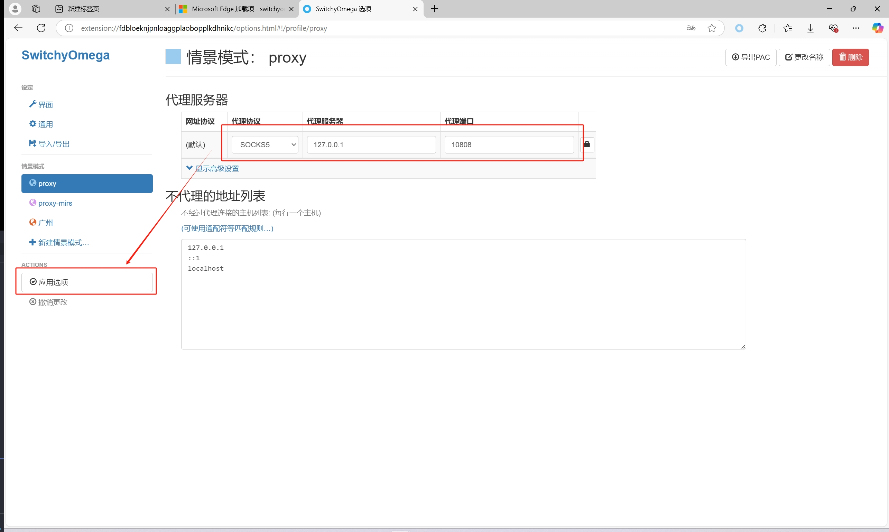
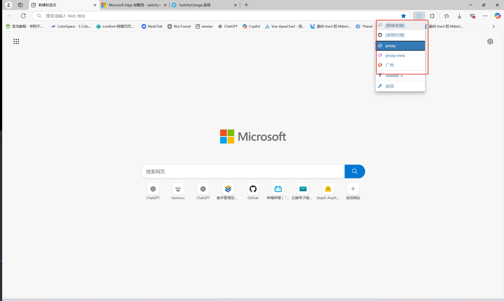

本教程部分代理只适用于Ubuntu系统

<!-- more -->

# Linux环境下常用的代理配置  

此教程包含全局、用户、git、docker等代理设置

## 全局代理设置  

本人最常用的代理设置，基本上可以接管除了git、docker等部分不走正常网络协议之外的所有网络请求  

**1.编辑/etc/environment**

```bash
sudo nano /etc/environment
```

**2.在该文件中添加代理配置**  
添加以下行：   
```
http_proxy="http://<proxy-server>:<port>"
https_proxy="http://<proxy-server>:<port>"
```
假如你的代理服务器及其端口是192.168.10.88:10808  
则输入为：
```
http_proxy="http://192.168.10.88:10808"
https_proxy="http://192.168.10.88:10808"
```

nano编辑器的保存是ctrl+s或者ctrl+o
退出是ctrl+x

**3.最后source一下**

```bash
source /etc/environment
```

## 临时代理设置  

有的时候我们并不想一直开着代理，使用到代理的次数也屈指可数，这个时候我们可以选择单独终端配置临时代理
甚至有的时候全局代理无法生效的时候使用这种方式也有奇效

直接在终端输入:  

```bash
export http_proxy="http://<proxy-server>:<port>"
export https_proxy="http://<proxy-server>:<port>"
```

假如你的代理服务器及其端口是192.168.10.88:10808  
则输入为：

```bash
export http_proxy="http://192.168.10.88:10808"
export https_proxy="http://192.168.10.88:10808"
```

## 用户代理设置

有的时候，我们只能为或只需为用户设置代理，这个时候就可以设置用户代理了(实际上用户代理只是临时代理的持久化)

**1.打开~/.bashrc文件**

```bash
nano ~/.bashrc
```

**2.在该文件中添加代理配置**

添加以下行： 

```
export http_proxy="http://<proxy-server>:<port>"
export https_proxy="http://<proxy-server>:<port>"
```

假如你的代理服务器及其端口是192.168.10.88:10808  
则输入为：

```
export http_proxy="http://192.168.10.88:10808"
export https_proxy="http://192.168.10.88:10808"
```

**3.source一下**

```bash
source ~/.bashrc
```

## ubuntu图像界面GUI设置方式

>1.点开设置-->2.点击网络设置-->3.点击设置代理-->4.配置你的代理服务器和端口-->保存即可  


## chrome浏览器代理设置(edge同样适用)

**1.点开浏览器扩展界面**


**2.在扩展市场搜索switchyomega并下载**


**3.将其变得可见**


**4.进入配置**
  

选择协议配置服务器与端口：
  
配置完就可以使用了

**5.随时切换**

还可以创建多个来随时切换不同的代理，也可以切回系统本来的网络
   

## git设置代理  

两行命令的事

```bash
git config --global http.proxy http://<proxy-server>:<port>
git config --global https.proxy http://<proxy-server>:<port>
```
假如你的代理服务器及其端口是192.168.10.88:10808  
则输入为：
```bash
git config --global http.proxy http://192.168.10.88:10808
git config --global https.proxy http://192.168.10.88:10808
```
不加gobal就是单个仓库，加了就是全局(用户全局)

想要去文件操作的记住配置文件是~/.gitconfig  

## apt设置代理

其实如果已经配置了全局代理的一般都可以接管apt了，但是还是教一下  

**1.编辑/etc/apt/apt.conf.d/proxy.conf(或/etc/environment)**

```bash
sudo nano /etc/apt/apt.conf.d/proxy.conf
```

**2.在该文件中添加代理配置**  
添加以下行：   
```
Acquire::http::proxy="http://<proxy-server>:<port>"
Acquire::https::proxy="http://<proxy-server>:<port>"
```
假如你的代理服务器及其端口是192.168.10.88:10808  
则输入为：
```
Acquire::http::proxy="http://192.168.10.88:10808"
Acquire::http::proxy="http://192.168.10.88:10808"
```

**3.最后source一下**

```bash
source /etc/apt/apt.conf.d/proxy.conf
```

## apt换源  

**1.编辑/etc/apt/sources.list**

```bash
sudo nano /etc/apt/sources.list
```

**2.在该文件中添加清华源配置**  
添加以下行：   
```
# 默认注释了源码镜像以提高 apt update 速度，如有需要可自行取消注释
deb https://mirrors.tuna.tsinghua.edu.cn/ubuntu/ xenial main restricted universe multiverse
# deb-src https://mirrors.tuna.tsinghua.edu.cn/ubuntu/ xenial main main restricted universe multiverse
deb https://mirrors.tuna.tsinghua.edu.cn/ubuntu/ xenial-updates main restricted universe multiverse
# deb-src https://mirrors.tuna.tsinghua.edu.cn/ubuntu/ xenial-updates main restricted universe multiverse
deb https://mirrors.tuna.tsinghua.edu.cn/ubuntu/ xenial-backports main restricted universe multiverse
# deb-src https://mirrors.tuna.tsinghua.edu.cn/ubuntu/ xenial-backports main restricted universe multiverse
deb https://mirrors.tuna.tsinghua.edu.cn/ubuntu/ xenial-security main restricted universe multiverse
# deb-src https://mirrors.tuna.tsinghua.edu.cn/ubuntu/ xenial-security main restricted universe multiverse

# 预发布软件源，不建议启用
# deb https://mirrors.tuna.tsinghua.edu.cn/ubuntu/ xenial-proposed main restricted universe multiverse
# deb-src https://mirrors.tuna.tsinghua.edu.cn/ubuntu/ xenial-proposed main restricted universe multiverse
```

**3.最后更新一下**

```bash
sudo apt-get update
```

## docker设置代理

**1.创建文件夹/etc/systemd/system/docker.service.d**
```bash
sudo mkdir /etc/systemd/system/docker.service.d
```

**2.编辑/etc/systemd/system/docker.service.d/proxy.conf文件**  
```bash
sudo nano sudo mkdir /etc/systemd/system/docker.service.d/proxy.conf
```

输入以下行：
```
[Service] 
Environment="HTTP_PROXY=代理服务器ip:port" 
Environment="HTTPS_PROXY=代理服务器ip:port"
```

假如你的代理服务器及其端口是192.168.10.88:10808  
则输入为：

```
[Service] 
Environment="HTTP_PROXY=192.168.10.88:10808" 
Environment="HTTPS_PROXY=192.168.10.88:10808"
```

**3.重启docker**

```bash
sudo systemctl daemon-reload		#重启daemon进程
sudo systemctl restart docker		#重启docker
```

**4.验证**  
```bash
docker info
```
在长串info信息中如果出现类似下文的内容：
HTTP Proxy: 代理服务器ip:port
HTTPS Proxy: 代理服务器ip:port

说明你成功了，现在拉取镜像就是走的代理的

## python设置清华源  

在pip install <依赖包>后面加上 -i https://pypi.tuna.tsinghua.edu.cn/simple

假如下载numpy

```bash
pip install numpy -i https://pypi.tuna.tsinghua.edu.cn/simple
```