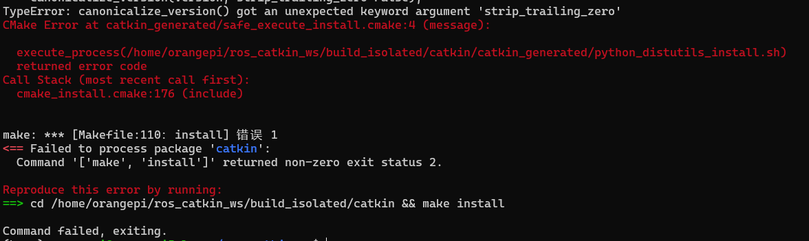

其实x86版本的网络上还是有一堆一键安装脚本的，但是我遇到了必须使用arm的场景

<!-- more -->

<span style="font-size: x-large;">`Ubunutu22.04安装ros1（arm版本）</span>

# ubuntu22.04如何安装ros1  

**为了避免墙的问题，建议直接开全局代理或者用户代理**
怎么开这里就不教了

### 1.添加ros源  

由于ROS1官网不支持，因此只能添加ROS2的源
```bash
sudo apt update && sudo apt install curl
sudo curl -sSL https://raw.githubusercontent.com/ros/rosdistro/master/ros.key -o /usr/share/keyrings/ros-archive-keyring.gpg
echo "deb [arch=$(dpkg --print-architecture) signed-by=/usr/share/keyrings/ros-archive-keyring.gpg] http://packages.ros.org/ros2/ubuntu $(. /etc/os-release && echo $UBUNTU_CODENAME) main" | sudo tee /etc/apt/sources.list.d/ros2.list > /dev/null
 
sudo apt update
```

### 2.安装编译依赖  

```bash
sudo apt-get install python3-rosdep python3-rosinstall-generator python3-vcstools python3-vcstool build-essential
sudo pip3 install -U rosdep rosinstall_generator vcstool
sudo pip3 install --upgrade setuptools
```

### 3.新建catkin workspace  

```bash
mkdir ~/ros_catkin_ws
cd ~/ros_catkin_ws
```

### 5.拉取ROS Noetic源码  

```bash
rosinstall_generator desktop --rosdistro noetic --deps --tar > noetic-desktop.rosinstall
mkdir ./src
vcs import --input noetic-desktop.rosinstall ./src
``` 

这里的第一步容易遇到拒绝访问的报错，所以还是尽快开代理就好了，第三步也容易被墙，代理！！！！！  

### 6.手动安装ROS Noetic依赖  

```bash
sudo apt install libboost-all-dev uuid-dev python3-nose google-mock libgtest-dev libbz2-dev libgpgme-dev libssl-dev python3-coverage libboost-program-options-dev python3-psutil python3-opengl python3-pygraphviz python3-pydot qt5-qmake sbcl libapr1-dev libaprutil1-dev libboost-regex-dev liblog4cxx-dev python3-matplotlib libpyside2-dev libshiboken2-dev pyqt5-dev python3-pyqt5 python3-pyqt5.qtsvg python3-pyside2.qtsvg python3-sip-dev shiboken2 lm-sensors graphviz python3-paramiko python3-pycryptodome python3-gnupg python3-defusedxml python3-pyqt5.qtopengl libcurl4-openssl-dev libpoco-dev libogre-1.9-dev libassimp-dev libogre-1.9.0v5 libyaml-cpp-dev libgl1-mesa-dev libglu1-mesa-dev libqt5opengl5 libqt5opengl5-dev libopencv-dev python3-opencv python3-pykdl tango-icon-theme liborocos-kdl-dev libtinyxml-dev libtinyxml2-dev liburdfdom-headers-dev python3-numpy python3-empy libboost-filesystem-dev libboost-thread-dev python3-pygraphviz python3-pygraphviz python3-mock libboost-date-time-dev libboost-system-dev liburdfdom-dev libboost-chrono-dev libboost-dev libqt5core5a libqt5gui5 libqt5widgets5 qtbase5-dev  libconsole-bridge-dev liblz4-dev python3-pyqt5.qtwebkit exfatprogs
```

遇到冲突就一个一个解决吧

### 7.编译（终于，这里会遇到非常非常多的问题！）

```bash
./src/catkin/bin/catkin_make_isolated --install -DCMAKE_BUILD_TYPE=Release -DPYTHON_EXECUTABLE=/usr/bin/python3
```



这个是setuptools版本的问题

解决方法：下载64版本

```bash
pip install setuptools==64
```

还有可能会遇到与ros2环境冲突问题

解决方法：卸载ros2的环境变量

```bash
unset ROS_DISTRO
```

- rosconsole问题

```
Errors     << rosconsole:make /home/youliang/ros_ws/build/catkin_ws/logs/rosconsole/build.make.002.log                                               
/home/youliang/ros_ws/build/catkin_ws/src/rosconsole/src/rosconsole/impl/rosconsole_log4cxx.cpp: In function ‘void ros::console::impl::initialize()’:
/home/youliang/ros_ws/build/catkin_ws/src/rosconsole/src/rosconsole/impl/rosconsole_log4cxx.cpp:169:23: error: cannot convert ‘ros::console::impl::ROSConsoleStdioAppender*’ to ‘log4cxx::AppenderPtr’ {aka ‘std::shared_ptr<log4cxx::Appender>’}
  169 |   logger->addAppender(new ROSConsoleStdioAppender);
      |                       ^~~~~~~~~~~~~~~~~~~~~~~~~~~
      |                       |
      |                       ros::console::impl::ROSConsoleStdioAppender*
In file included from /usr/include/log4cxx/spi/loggingevent.h:28,
                 from /usr/include/log4cxx/layout.h:29,
                 from /usr/include/log4cxx/appenderskeleton.h:28,
                 from /home/youliang/ros_ws/build/catkin_ws/src/rosconsole/src/rosconsole/impl/rosconsole_log4cxx.cpp:42:
/usr/include/log4cxx/logger.h:144:60: note:   initializing argument 1 of ‘virtual void log4cxx::Logger::addAppender(log4cxx::AppenderPtr)’
  144 |                 virtual void addAppender(const AppenderPtr newAppender);
      |                                          ~~~~~~~~~~~~~~~~~~^~~~~~~~~~~
/home/youliang/ros_ws/build/catkin_ws/src/rosconsole/src/rosconsole/impl/rosconsole_log4cxx.cpp: In function ‘void* ros::console::impl::getHandle(const string&)’:
/home/youliang/ros_ws/build/catkin_ws/src/rosconsole/src/rosconsole/impl/rosconsole_log4cxx.cpp:203:36: error: cannot convert ‘log4cxx::LoggerPtr’ {aka ‘std::shared_ptr<log4cxx::Logger>’} to ‘void*’ in return
  203 |   return log4cxx::Logger::getLogger(name);
      |          ~~~~~~~~~~~~~~~~~~~~~~~~~~^~~~~~
      |                                    |
```

解决方法：将src目录下面的rosconsole更新成concise_output_roso分支


从GitHub - lucasw/rosconsole  https://github.com/lucasw/rosconsole  拉取rosconsole的源码，切到concise_output_roso分支，覆盖到~/ros_catkin_ws/src下。

```bash
git clone -b concise_output_roso https://github.com/lucasw/rosconsole.git  
rm -rf src/rosconsole
mv rosconsole src
```

- shared_mutex的问题  

```
make[2]: *** [CMakeFiles/tf.dir/build.make:118: CMakeFiles/tf.dir/src/transform_listener.cpp.o] Error 1
In file included from /usr/include/log4cxx/log4cxx.h:45,
from /usr/include/log4cxx/logstring.h:28,
from /usr/include/log4cxx/level.h:22,
from /opt/ros/noetic/include/ros/console.h:46,
from /opt/ros/noetic/include/ros/ros.h:40,
from /tmp/makepkg/ros-noetic-tf/src/geometry-1.13.2/tf/src/transform_broadcaster.cpp:34:
/usr/include/log4cxx/boost-std-configuration.h:10:18: error: ‘shared_mutex’ in namespace ‘std’ does not name a type
10 | typedef std::shared_mutex shared_mutex;
| ^~~~~~~~~~~~
/usr/include/log4cxx/boost-std-configuration.h:10:13: note: ‘std::shared_mutex’ is only available from C++17 onwards
10 | typedef std::shared_mutex shared_mutex;
| ^~~
/usr/include/log4cxx/boost-std-configuration.h:12:30: error: ‘shared_lock’ in namespace ‘std’ does not name a template type
12 | using shared_lock = std::shared_lock<T>;
| ^~~~~~~~~~~
/usr/include/log4cxx/boost-std-configuration.h:12:25: note: ‘std::shared_lock’ is only available from C++14 onwards
12 | using shared_lock = std::shared_lock<T>;
| ^~~
In file included from /opt/ros/noetic/include/ros/console.h:46,
from /opt/ros/noetic/include/ros/ros.h:40,
from /tmp/makepkg/ros-noetic-tf/src/geometry-1.13.2/tf/src/transform_broadcaster.cpp:34:
/usr/include/log4cxx/level.h:283:29: error: ‘mutex’ in namespace ‘std’ does not name a type
283 | static std::mutex initMutex;
| ^~~~~
/usr/include/log4cxx/level.h:25:1: note: ‘std::mutex’ is defined in header ‘<mutex>’; did you forget to ‘#include <mutex>’?
24 | #include <log4cxx/helpers/object.h>
+++ |+#include <mutex>
25 |
```

解决方法：  
修改/usr/include/log4cxx/boost-std-configuration.h中的

```
#define STD_SHARED_MUTEX_FOUND 1
#define Boost_SHARED_MUTEX_FOUND 0
```
为
```
#define STD_SHARED_MUTEX_FOUND 0
#define Boost_SHARED_MUTEX_FOUND 1
```

- std_msgs问题

编译此包易出现找不到genmsg模块的报错，实际上我没有找到真正的原因

如果出现，请尝试商储缓存重新编译，获将一开始的流程重新来一遍
  
- cv_brige问题

容易出现boost的版本冲突问题，原因在于我装了conda，conda里的cmake包带了boost是1.82的，和ros的1.74冲突了

解决方法
>删除conda里面包含boost的包即可，注意刷新一下conda环境

### 8.source环境变量就可以用了

```bash
source ~/ros_catkin_ws/install_isolated/setup.bash
```

可以输入roscore启动master节点测试是否成功（没报红应该就没问题了）