基于Embedded IDE在VScode上配置keil c环境

 

入手51单片机，绕不开一款软件--keil，它内置了非常多芯片的配置，几乎是最全面的软件，也是很多嵌入式工程师的第一选择，然而几乎入手keil的每个人都会抱怨，已经什么年代了，怎么界面还是这么古老，而且支持的更改少，无代码补全功能，种种缺点另许多程序员苦不堪言，我亦是如此  
 

**要是能够在vscode上开发就好了，世界上最丰富的插件市场，酷炫的界面，强大github copilot等ai代码辅助工具，真是令人欲罢不能**  
 

这个时候，我突然想到，我在vscode上配置了这么多环境*（c/c++、python、vue、node.js等等数不胜数）*，一定可以配置C51吧，在网上一搜，哦~其实嵌入式开发使用vscode已成常态，不过基本都是32之后，使用vscode配置c51还是少部分，找了许多种方法，终于找到一个非常适合自己的  
 

以下就是详细的配置教程

**1.下载vscode，直接搜索下载即可，需要注意的是下载系统版的**  
 

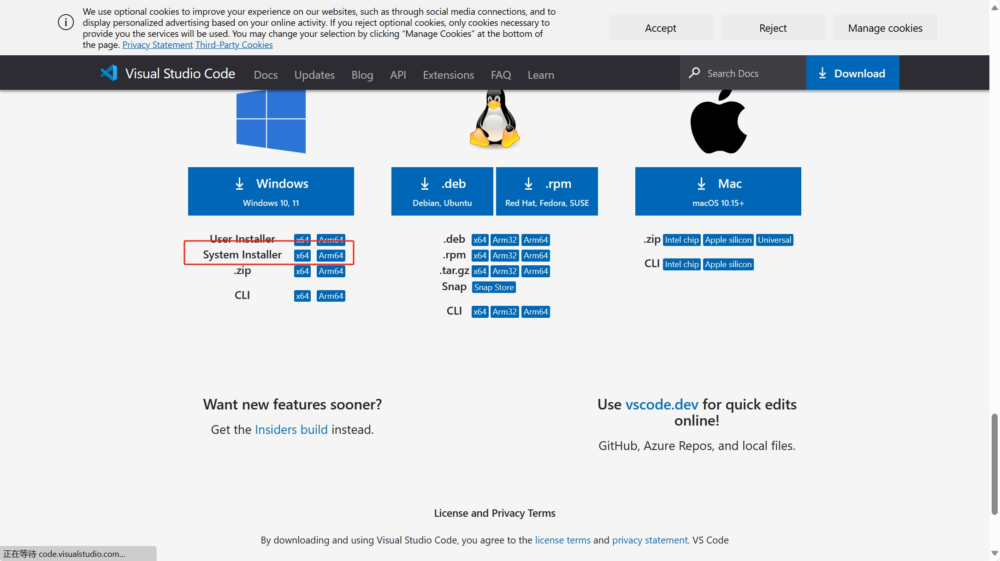
 

**2.在vscode中安装插件Embedded IDE，安装时间较长，等一会咯**  
 

 

**3.打开keil C51的安装目录，找到TOOLS.INI文件并记住该文件路径**  
 

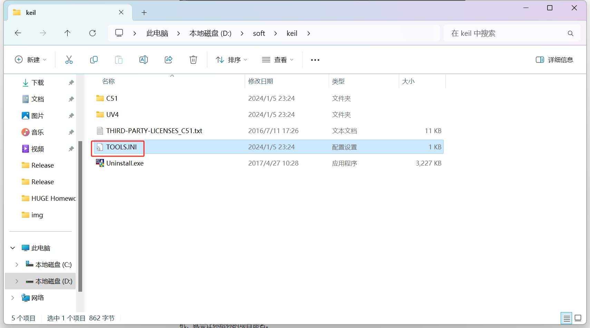  
 

**4.打开vscode点开左侧菜单栏Embedded IDE图标打开插件然后点击操作，点击设置工具链路径，设置刚刚看过的TOOLS.INI文件**  
 

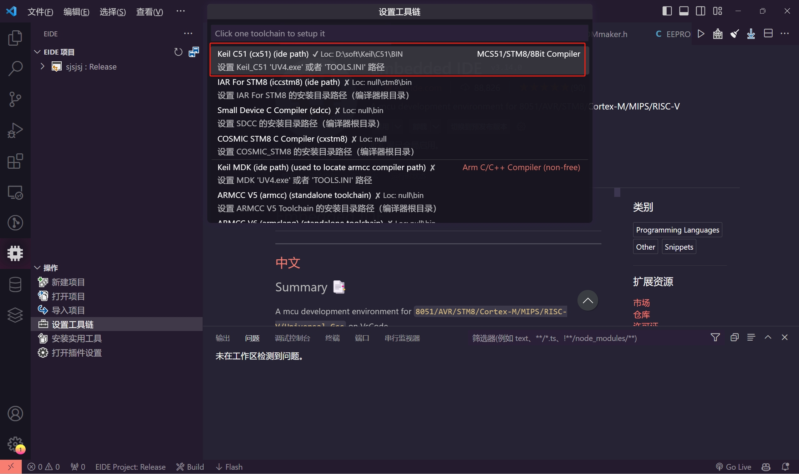  
 

点开后选择keil的TOOLS.INI文件  
 

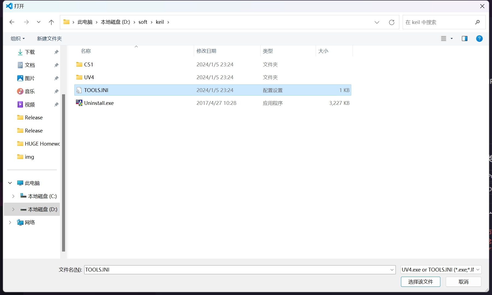  
 

看到这其实你也明白了吧，实际上也是调用了keil的接口罢了
 

**5.设置完成后就可以点击新建项目或者导入keil项目，新建项目点击之后选择空项目，选择8位MCU，，随后命名完就创建成功了**
 

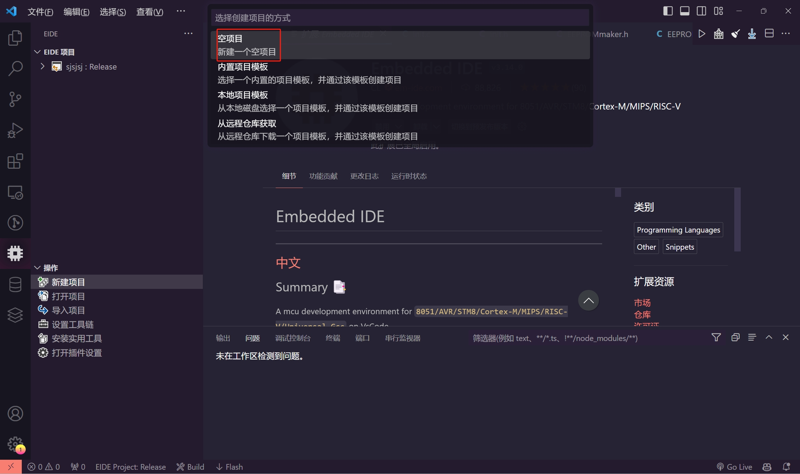  
 

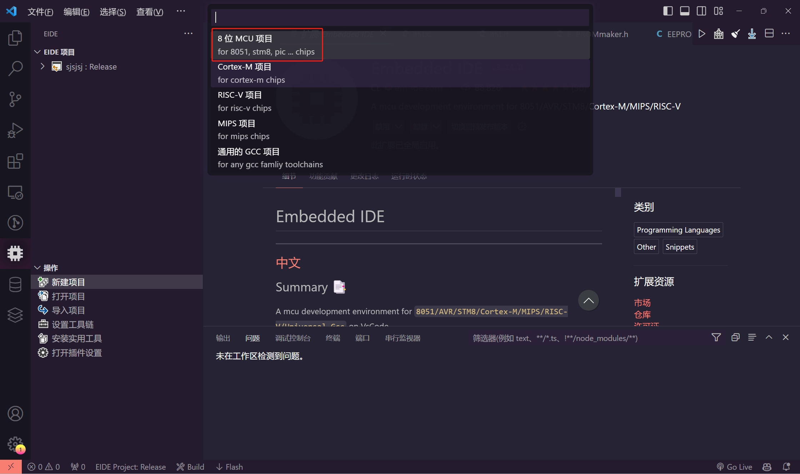  
 

**6.创建好之后在创建好的项目目录下点击构建配置并换成keil C51**  
 

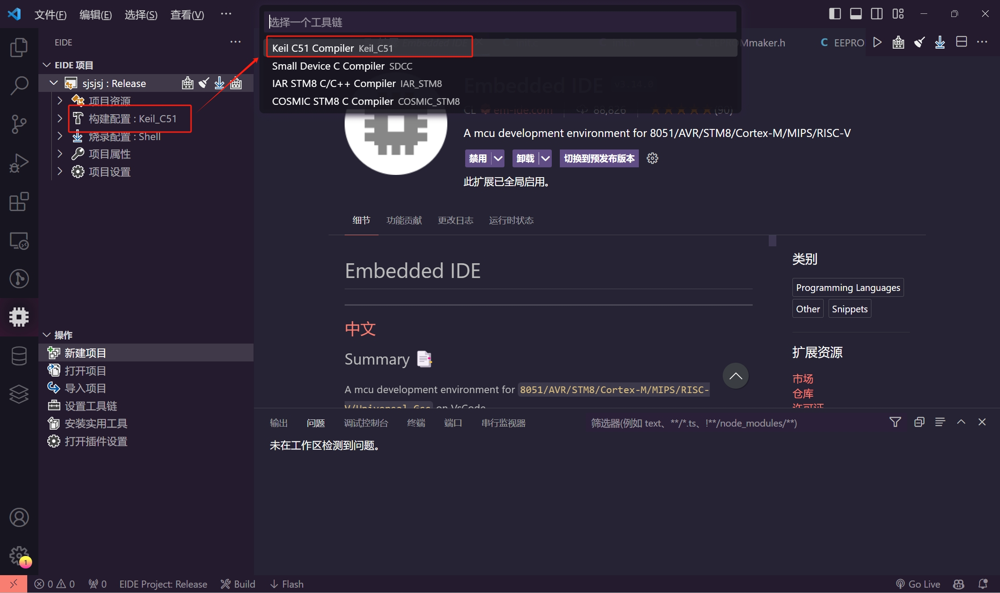  
 

**7.src目录就是存放代码的目录，在这里会有一个main.c文件，现在已经可以正常的写代码了**
 

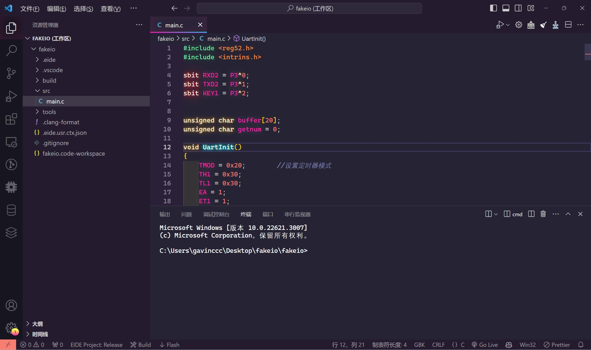  
 

也可以点击左侧菜单栏Embedded IDE图标来打开src目录（这样更容易看工程目录）
 

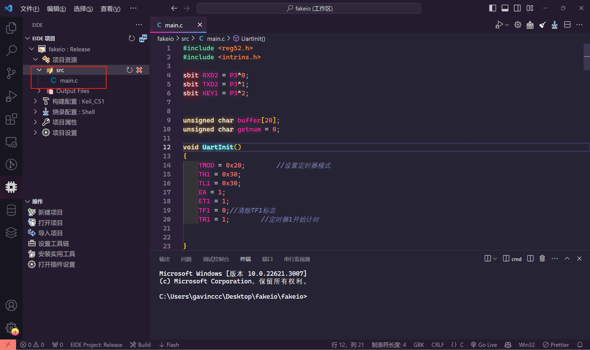  
 

**8.在右上角点击构建图标即可编译**
 

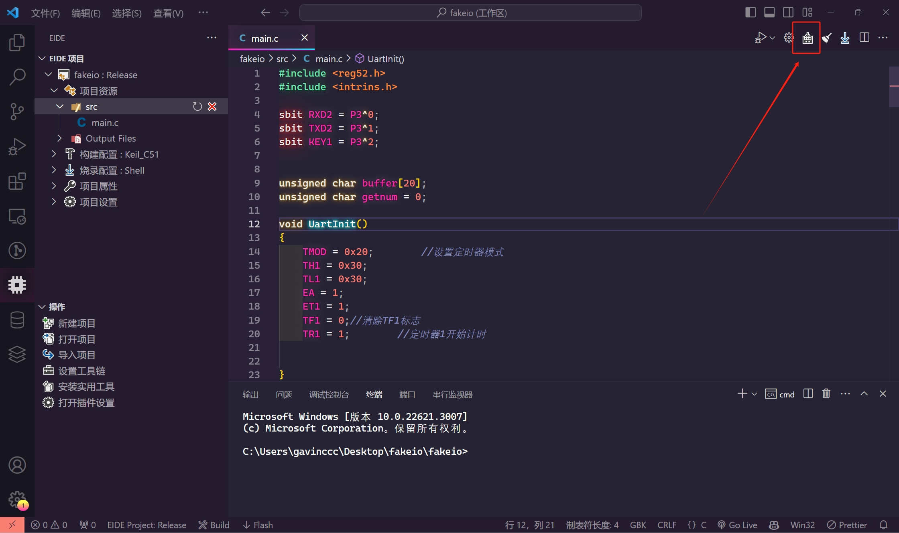  
 

**9.编译通过会在build目录生成hex文件，这样就可以正常烧录了**
 

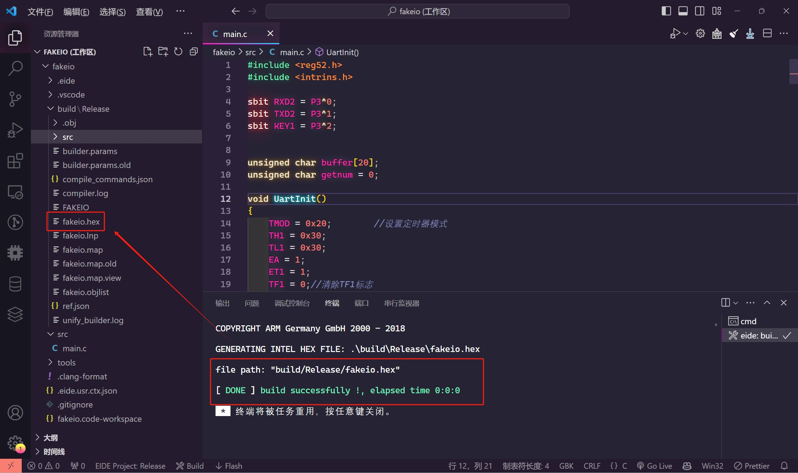 
 

**10.再次打开只需选择工程的code-workspace文件即可**
 

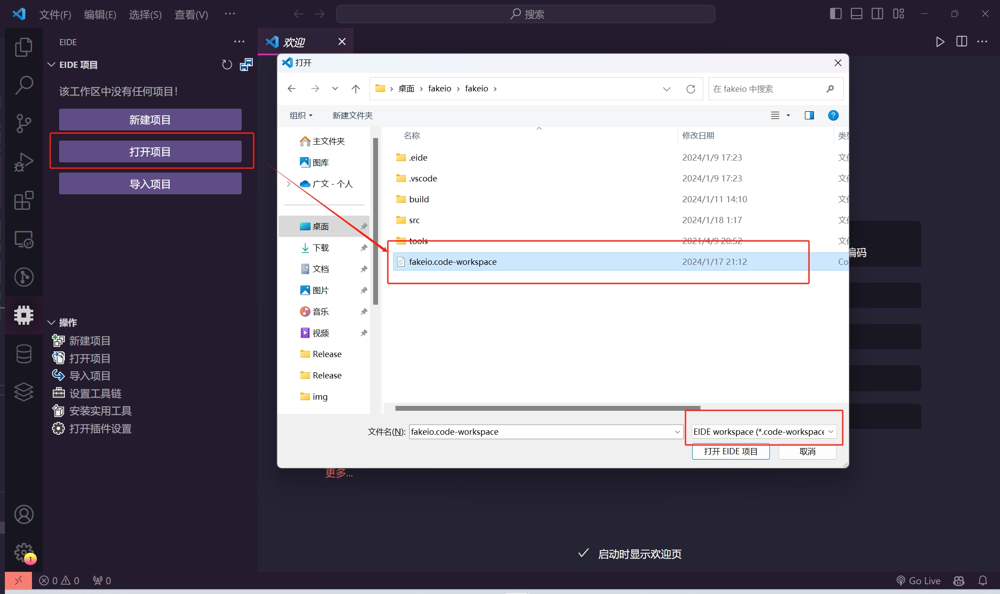  
 

也可以打开老keil项目  
 

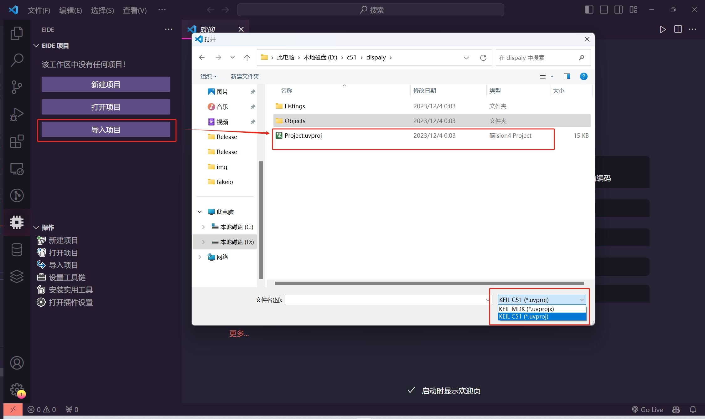  
 

也是可以正常烧录
 

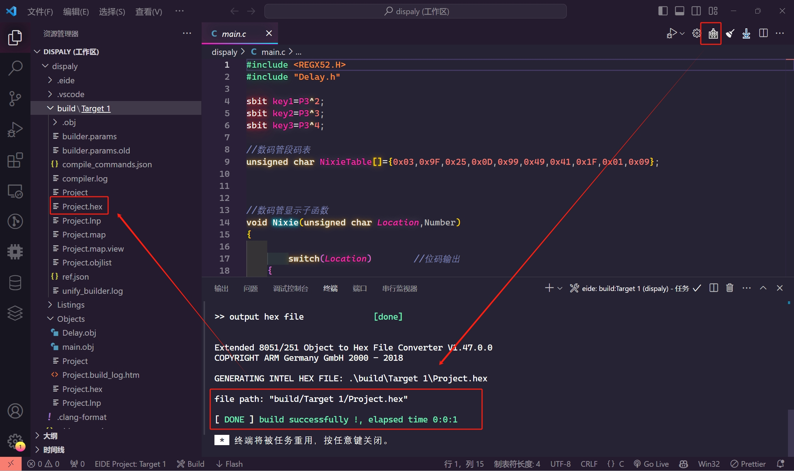  
 

>理论上来说stm32与arduino都可以使用，不过在面对不同的环境时，可能会有更好的方法，没关系，遇水搭桥，逢山修路，要是遇到更好的方法，后续会有更新