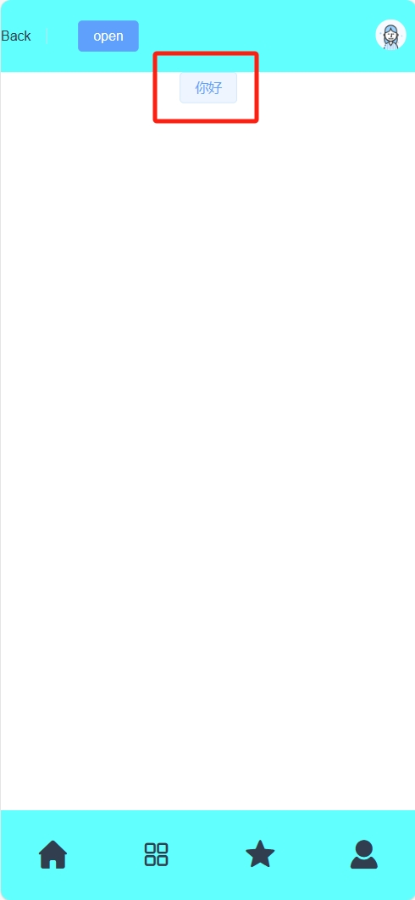
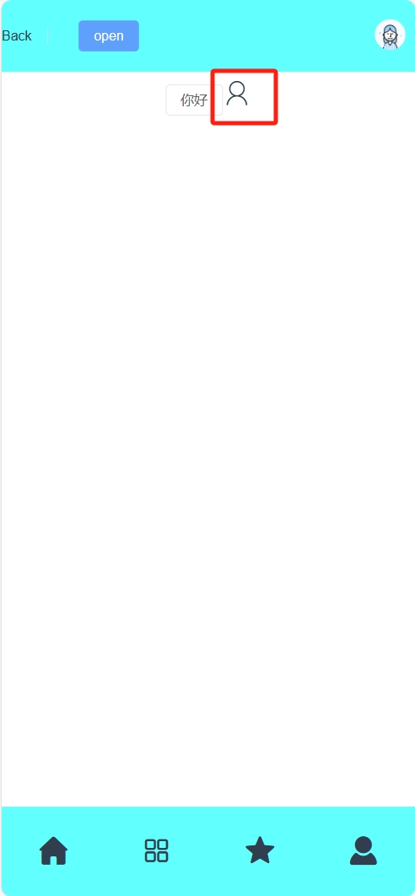







<!-- more -->

配合视频观看更佳！

## 前期准备

在开始前端之旅之前，我们不得不准备好一些必要的东西  

**Node.js**
Node.js是前端开发环境，它的出现造成了前端大爆发，也造就了React和Vue的辉煌，它是目前前端必不可少的  
**npm**
前端的爆发使js开发者越来越多，开源贡献者也越来越多，于是凝结出了世界上最大的软件包仓库，它是前端开发者接轨世界必不可少的
**nvm**
一个Node.js的版本管理工具

**如果你并没有准备好这些必要的工具，请前往以下站点阅读配置**




**由于npm镜像源在国外，国内速度受限,可以配置国内镜像源加速，参考以下文章配置**


**还可以换成yarn包管理工具，区别在于yarn更快！**
```
npm install --global yarn
```
使用cmd运行即可

## 开始vite工程

在开始之前，请再次确认是否已准备完成

打开cmd运行以下命令，请在合适的文件夹打开cmd（右键打开终端即可）

<!-- tab yarn -->

```
yarn create vite my-vue-app --template vue
```

<!-- endtab -->

<!-- tab npm -->

```
npm create vite@latest
```

<!-- endtab -->

这里面的my-vue-app换成自己项目名字
记得选择JavaScript



根据运行以下命令
**1.移至项目目录**

```
cd my-vue-app
```
这里的my-vue-app是自己的项目名  

**2.下载依赖（就是在npm源中下载需要的库）**  

<!-- tab yarn -->

```
yarn
```

<!-- endtab -->

<!-- tab npm -->

```
npm i
```

<!-- endtab -->

**3.启动项目**

<!-- tab yarn -->

```
yarn dev
```

<!-- endtab -->

<!-- tab npm -->

```
npm run dev
```

<!-- endtab -->

运行成功看到以下状态


>红框框起来的网址端口就是vite工程的端口

点开这个网址就可以看到工程展示界面


至此，启动工程就结束了

## VSCode编写vite+vue工程

使用vscode打开刚刚创建好的工程目录

打开之后第一件事将npm脚本勾选上，这样就可以使用图形化界面运行脚本（而非命令）


我们依次来看工程目录的作用


>- .vscode:存放vscode的配置文件
>- node_modules:存放安装好的依赖包
>- piblic:存放音频图片的文件，该目录下的文件在打包时不会更改路径，在引用该目录下的文件时仅需（./文件名）
>- src:存放代码文件，一般来说，我们只会在src目录下进行活动
>- src.assets:存放音频图片的文件,引用该目录文件时需正常填写相对路径
>- src.components: 存放vue工程的组件代码
>- src.pages:存放vue工程的页面代码（原本并没有这个目录，是我自己创的）
>- src.App.vue:vue的入口文件
>- src.style.css:整个工程的css
>- src.main.js:全局js
>- index.html:整个工程的html文件，挂载着App.vue
>- package.json:工程的配置文件清单，npm i命令就是在这个文件中寻找所需依赖

最后我们来看一下vue是怎么写的


```JavaScript
<template>
  <h1>这里存放html代码:{{ msg }}</h1>
</template>

<script>
// 这里存放js代码
export default {
  data() {
    return {
      msg: 'Welcome to Your Vue.js App'
    }
  }
}
</script>

<style scoped>
/* 这里存放css代码 */
h1{
  color: red;
}
</style>
```

除了js部分编写代码可能有所不同其余皆相同，值得注意的是css标签加上的scoped是为了避免选择器冲突问题

## 页面、路由和组件

### 页面

>在开始之前，我们要明白，开发一个app,无论是web、桌面或者小程序，第一个开发的是什么界面呢？





比如一个手机app小程序，就像微信，作用域范围最广的就是微信底下的导航栏，如下


这个底下的导航栏，首页、分类、推荐、我的就是作用域范围最广的界面
body的内容可以更换，但是底下的永远不变

以此为准，我们写一个界面出来，首先创建pages目录
然后新建trunk.vue文件，trunk的意思是主干的意思，最广作用域范围的界面就是整个app的主干

好的我直接把我trunk.vue的代码放出来

```JavaScript
<template>
  <div class="main">
    <h1>body</h1>
  </div>
  <div class="foot">
    <div class="footmenu">
      <span >首页</span>
      <span >分类</span>
      <span >推荐</span>
      <span >我的</span>
    </div>
  </div>
</template>

<script>

</script>

<style scoped>
.main {
  height: 93vh;
  width: 100vw;
}

.footmenu {
  box-shadow: 0px -1px 1px #dcdfe6;
  height: 7vh;
  width: 100vw;
  background-color: #fff;
  display: flex;
  justify-content: space-around;
  align-items: center;
}

span {
  width: 25%;
  height: 100%;
  line-height: 400%;
}
</style>
```

我们还需要在App.vue导入trunk.vue

```JavaScript
<script>
import trunk from './pages/trunk.vue';
export default {
  components: {
    trunk,
  },
};
</script>

<template>
  <div id="app">
    <trunk />
  </div>
</template>

<style scoped>
#app {
  font-family: Avenir, Helvetica, Arial, sans-serif;
  -webkit-font-smoothing: antialiased;
  -moz-osx-font-smoothing: grayscale;
  text-align: center;
  color: #2c3e50;
}
</style>
```
这里的trunk标签就是trunk.vue的页面了

然而只是徒有其表而已，可以在浏览器预览一下


body部分有点不一样，没关系，下面一样就好了



为解决这个问题，我们使用路由来解决，vue-router

### 路由

大家可以去源站看router的教程



配置router
**1.引入router**
在项目目录打开cmd
输入命令导入


<!-- tab yarn -->

```
yarn add vue-router@4
```

<!-- endtab -->

<!-- tab npm -->

```
npm install vue-router@4
```

<!-- endtab -->



直接打开vscode的cmd输入即可


**2.编写router.js文件并全局引入router.js**

在src目录新建应该router目录并在该目录创建router.js文件
在里面写入以下代码
```JavaScript
import { createRouter, createWebHistory } from 'vue-router';

const router = createRouter({
  history: createWebHistory(),
  routes: [
    {
      path: '/',
      name: '',
      redirect: '/home',
    },
    {
      path: '/home',
      name: 'home',
      component: () => import('../pages/home.vue'),
      meta: {
        home: true,
      },
    },
  ],
});

export default router;
```

有人问为什么要这么写，这里不做过多阐述，需要了解的请点上面的链接进router官网学习

点开main.js，添加以下代码
```JavaScript
import router from './router/router.js';
createApp(App).use(router).mount('#app');
```
其中createApp(App).mount('#app');原本就有了，只需要加入.use(router)即可


这样子，页面首先就会跳到home界面了

我们现在要实现4个界面，分别是首页，分类，推荐，我的
我们分别在pages目录创建home.vue,classify.vue,about.vue,user.vue并在里面编写内容

然后在router.js加入这些页面的路由

以下是完整的router.js

```JavaScript

import { createRouter, createWebHistory } from 'vue-router';

const router = createRouter({
  history: createWebHistory(),
  routes: [
    {
      path: '/',
      name: '',
      redirect: '/home',
    },
    {
      path: '/home',
      name: 'home',
      component: () => import('../pages/home.vue'),
      meta: {
        home: true,
      },
    },
    {
      path: '/user',
      name: 'user',
      component: () => import('../pages/user.vue'),
      meta: {
        user: true,
      },
    },
    {
      path: '/classify',
      name: 'classify',
      component: () => import('../pages/classify.vue'),
      meta: {
        classify: true,
      },
    },
    {
      path: '/about',
      name: 'about',
      component: () => import('../pages/about.vue'),
      meta: {
        about: true,
      },
    },
  ],
});

export default router;
```

**3.在trunk中加入跳转函数**

```JavaScript
<template>
  <div class="main">
    <router-view></router-view>
  </div>
  <div class="foot" v-show="!$route.meta.childrenPage">
    <div class="footmenu">
      <span @click="goToHome">首页</span>
      <span @click="goToClassify">分类</span>
      <span @click="goToAbout">推荐</span>
      <span @click="goToUser">我的</span>
    </div>
  </div>
</template>

<script>
import Icon from '../components/Icon.vue';
export default {
  name: 'Trunk',
  components: {
    Icon,
  },
  data() {
    return {
      isActive: 1,
    };
  },
  methods: {
    goToUser() {
      this.$router.push('/user'); 
    },
    goToHome() {
      this.$router.push('/home');
    },
    goToClassify() {
      this.$router.push('/classify');
    },
    goToAbout() {
      this.$router.push('/about');
    },
  },
};
</script>

<style scoped>
.main {
  height: 93vh;
  width: 100vw;
}

.footmenu {
  box-shadow: 0px -1px 1px #dcdfe6;
  height: 7vh;
  width: 100vw;
  background-color: #fff;
  display: flex;
  justify-content: space-around;
  align-items: center;
}

span {
  width: 25%;
  height: 100%;
  line-height: 400%;
}
</style>
```

>这里的<router-view></router-view>就是可更换区域，点击我的就会将user.vue的内容放在这里面来，其他的亦是如此

预览一下



oky已经完成了！

### 组件

这里不做过多赘述

写在components目录下的文件即为组件
需要注意的是


>例子：
我封装了一个头部导航栏可以循环复用
我可以在其他页面使用，比如在首页和分类以及推荐都加上这个组件


## ElementsPlus的引入与使用

前端的大力发展也使的各种ui组件库层出不穷，什么是组件库？




大家可以去Element的官网查看文档



### Elements的引入（全局引入）

在项目终端输入命令以导入Element



<!-- tab yarn -->

```
yarn add element-plus
```

<!-- endtab -->

<!-- tab npm -->

```
npm install element-plus --save
```

<!-- endtab -->



在main.js文件中加入以下代码
```JavaScript
import ElementPlus from 'element-plus'
import 'element-plus/dist/index.css'

app.use(ElementPlus)
```

现在我们的main.js如下
```JavaScript
import { createApp } from 'vue'
import './style.css'
import ElementPlus from 'element-plus'
import 'element-plus/dist/index.css'
import App from './App.vue'

import router from './router/router.js'
createApp(App).use(router).use(ElementPlus).mount('#app')
```

现在，我们就可以在任意一个文件中使用Element了

### Element的使用

我们需要一边浏览Element的组件文档一边使用Element组件



比如我使用一个element的button组件

我在官方文档查看代码，直接在需要的地方直接写进去


让我们看看预览效果



成功！

其他组件，按需求使用即可

## iconfont的引入与使用

前端的工程避免不了使用到各种各样的图标，因此网上的图标库也是非常丰富的，比较著名的有fontawsome，其中iconfont是阿里巴巴图标库，是国内最大的图标库

本工程图标库使用iconfont作为图标库



首先在官网登录后点开我的项目


新建一个项目


名字随便起，尽量英文

随后在右上角的搜索栏搜索需要的图标，英文搜索最好，在这里我们搜索一下user

可以看到有非常非常多的图标


选择好之后将鼠标悬浮点击购物车图标


选择好几款（可以再次搜索多选择几个）点击右上角购物车图标，随后点击添加到项目


选择刚刚创建好的项目

根据图片的步骤生成代码，记得打开在线链接


复制这个代码即可

在components目录新建icon.vue

并输入以下代码
```JavaScript
<template>
    <i class="iconfont" :class="[iconclass, extraclass]"></i>
  </template>
  
  <script>
  var map = {
    user: 'icon-caidan07',
    user1：'icon-custom-user'
  };
  export default {
    props: {
      type: {
        type: String,
        required: true,
      },
      extraclass: {
        type: String,
        default: '',
      },
    },
    computed: {
      iconclass() {
        return map[this.type];
      },
    },
  };
  </script>
  
  <style scoped>
    {/* 输入自己的项目代码 */}
  @import '//at.alicdn.com/t/c/font_4186478_3epgt7s339h.css';
  </style>
```
这里的map对象就是一个映射，将右边的字符串赋值给左边的变量，右边的字符串里面需要填写iconfont的代码


左边随意取名，这样，在其他页面使用时就填左边自己取名的变量即可

这样就打包好了一个icon组件，使用也非常简单

比如就在刚刚的about界面里面使用

```JavaScript
<template>
    <div class="head">
        <Headerlist/>
    </div>
    <div class="main">
        <el-button>你好</el-button>
        <Icon type="user1" extraclass="icon"/>
    </div>
    
</template>

<script>
import Headerlist from '../components/header.vue'
import Icon from '../components/Icon.vue';
export default {
    name: 'home',
    components: {
        Headerlist,Icon
    }
}
</script>

<style scoped>
.icon{
    font-size: 30px;
}
</style>
```
这里Icon的type就是刚刚在icon组件定义的变量，对应着iconfont的图标
还可以使用extraclass定义类名在父组件修改样式

预览效果



这样我们的icon就这样完结了


