





<!-- more -->

配合视频观看更佳！

## 前期准备

在开始前端之旅之前，我们不得不准备好一些必要的东西  

**Node.js**
Node.js是前端开发环境，它的出现造成了前端大爆发，也造就了React和Vue的辉煌，它是目前前端必不可少的  
**npm**
前端的爆发使js开发者越来越多，开源贡献者也越来越多，于是凝结出了世界上最大的软件包仓库，它是前端开发者接轨世界必不可少的
**nvm**
一个Node.js的版本管理工具

**如果你并没有准备好这些必要的工具，请前往以下站点阅读配置**




**由于npm镜像源在国外，国内速度受限,可以配置国内镜像源加速，参考以下文章配置**


**还可以换成yarn包管理工具，区别在于yarn更快！**
```
npm install --global yarn
```
使用cmd运行即可

## 开始vite工程

在开始之前，请再次确认是否已准备完成

打开cmd运行以下命令，请在合适的文件夹打开cmd（右键打开终端即可）

<!-- tab yarn -->

```
yarn create vite my-vue-app --template vue
```

<!-- endtab -->

<!-- tab npm -->

```
npm create vite@latest
```

<!-- endtab -->

这里面的my-vue-app换成自己项目名字
记得选择JavaScript



根据运行以下命令
**1.移至项目目录**

```
cd my-vue-app
```
这里的my-vue-app是自己的项目名  

**2.下载依赖（就是在npm源中下载需要的库）**  

<!-- tab yarn -->

```
yarn
```

<!-- endtab -->

<!-- tab npm -->

```
npm i
```

<!-- endtab -->

**3.启动项目**

<!-- tab yarn -->

```
yarn dev
```

<!-- endtab -->

<!-- tab npm -->

```
npm run dev
```

<!-- endtab -->

运行成功看到以下状态
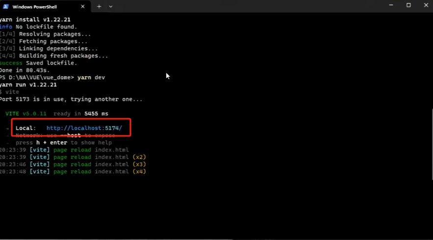

>红框框起来的网址端口就是vite工程的端口

点开这个网址就可以看到工程展示界面
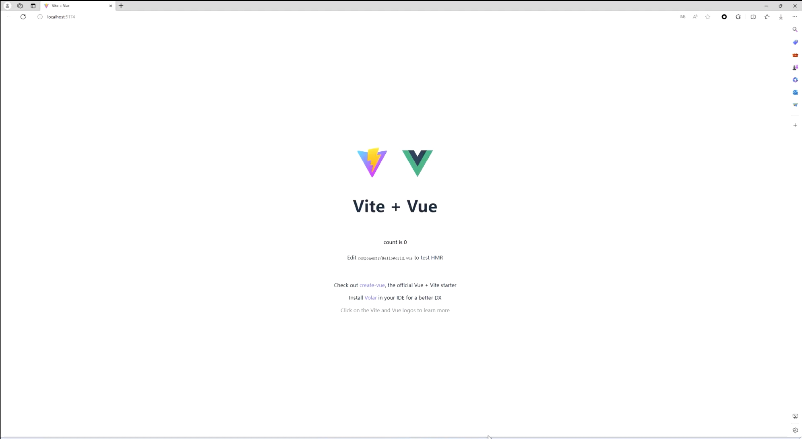

至此，启动工程就结束了

## VSCode编写vite+vue工程

使用vscode打开刚刚创建好的工程目录

打开之后第一件事将npm脚本勾选上，这样就可以使用图形化界面运行脚本（而非命令）

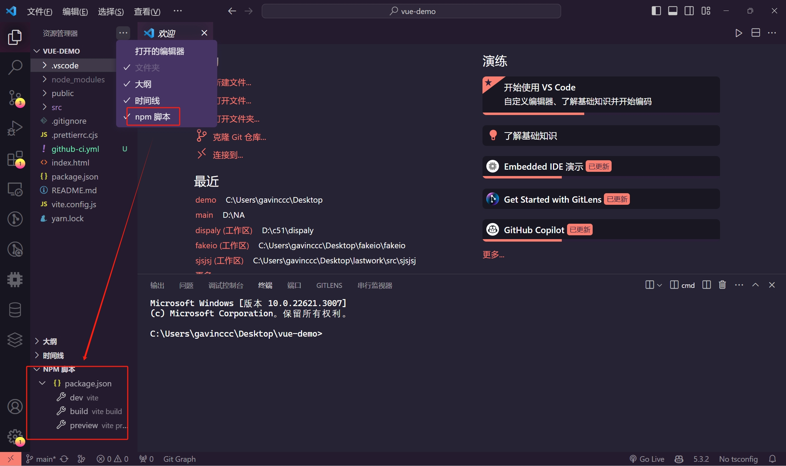

我们依次来看工程目录的作用

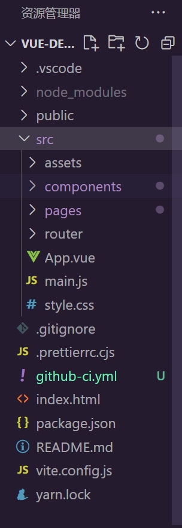

>- .vscode:存放vscode的配置文件
>- node_modules:存放安装好的依赖包
>- piblic:存放音频图片的文件，该目录下的文件在打包时不会更改路径，在引用该目录下的文件时仅需（./文件名）
>- src:存放代码文件，一般来说，我们只会在src目录下进行活动
>- src.assets:存放音频图片的文件,引用该目录文件时需正常填写相对路径
>- src.components: 存放vue工程的组件代码
>- src.pages:存放vue工程的页面代码（原本并没有这个目录，是我自己创的）
>- src.App.vue:vue的入口文件
>- src.style.css:整个工程的css
>- src.main.js:全局js
>- index.html:整个工程的html文件，挂载着App.vue
>- package.json:工程的配置文件清单，npm i命令就是在这个文件中寻找所需依赖

最后我们来看一下vue是怎么写的

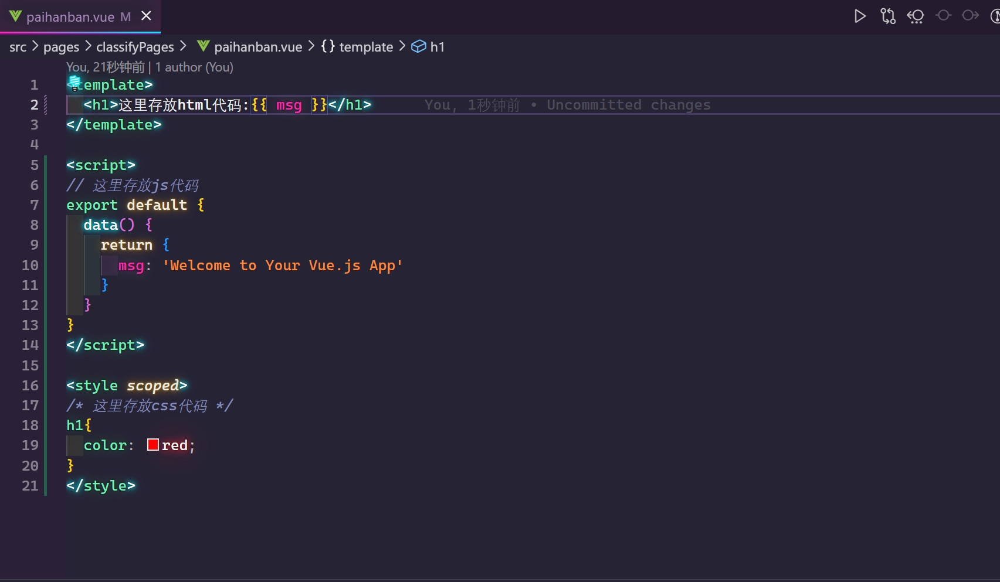

```JavaScript
<template>
  <h1>这里存放html代码:{{ msg }}</h1>
</template>

<script>
// 这里存放js代码
export default {
  data() {
    return {
      msg: 'Welcome to Your Vue.js App'
    }
  }
}
</script>

<style scoped>
/* 这里存放css代码 */
h1{
  color: red;
}
</style>
```

除了js部分编写代码可能有所不同其余皆相同，值得注意的是css标签加上的scoped是为了避免选择器冲突问题

## 页面、路由和组件

### 页面

>在开始之前，我们要明白，开发一个app,无论是web、桌面或者小程序，第一个开发的是什么界面呢？





比如一个手机app小程序，就像微信，作用域范围最广的就是微信底下的导航栏，如下

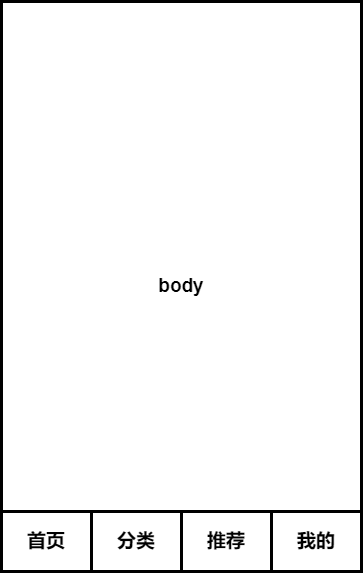

这个底下的导航栏，首页、分类、推荐、我的就是作用域范围最广的界面
body的内容可以更换，但是底下的永远不变

以此为准，我们写一个界面出来，首先创建pages目录
然后新建trunk.vue文件，trunk的意思是主干的意思，最广作用域范围的界面就是整个app的主干

好的我直接把我trunk.vue的代码放出来

```JavaScript
<template>
  <div class="main">
    <h1>body</h1>
  </div>
  <div class="foot">
    <div class="footmenu">
      <span >首页</span>
      <span >分类</span>
      <span >推荐</span>
      <span >我的</span>
    </div>
  </div>
</template>

<script>

</script>

<style scoped>
.main {
  height: 93vh;
  width: 100vw;
}

.footmenu {
  box-shadow: 0px -1px 1px #dcdfe6;
  height: 7vh;
  width: 100vw;
  background-color: #fff;
  display: flex;
  justify-content: space-around;
  align-items: center;
}

span {
  width: 25%;
  height: 100%;
  line-height: 400%;
}
</style>
```

我们还需要在App.vue导入trunk.vue

```JavaScript
<script>
import trunk from './pages/trunk.vue';
export default {
  components: {
    trunk,
  },
};
</script>

<template>
  <div id="app">
    <trunk />
  </div>
</template>

<style scoped>
#app {
  font-family: Avenir, Helvetica, Arial, sans-serif;
  -webkit-font-smoothing: antialiased;
  -moz-osx-font-smoothing: grayscale;
  text-align: center;
  color: #2c3e50;
}
</style>
```
这里的trunk标签就是trunk.vue的页面了

然而只是徒有其表而已，可以在浏览器预览一下
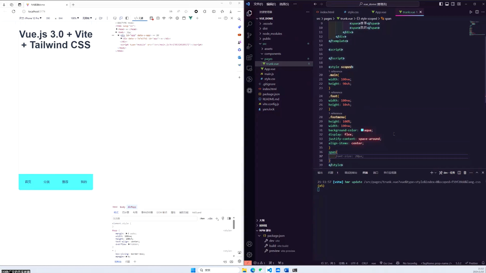

body部分有点不一样，没关系，下面一样就好了



为解决这个问题，我们使用路由来解决，vue-router

### 路由

大家可以去源站看router的教程



配置router
**1.引入router**
在项目目录打开cmd
输入命令导入


<!-- tab yarn -->

```
yarn add vue-router@4
```

<!-- endtab -->

<!-- tab npm -->

```
npm install vue-router@4
```

<!-- endtab -->



直接打开vscode的cmd输入即可
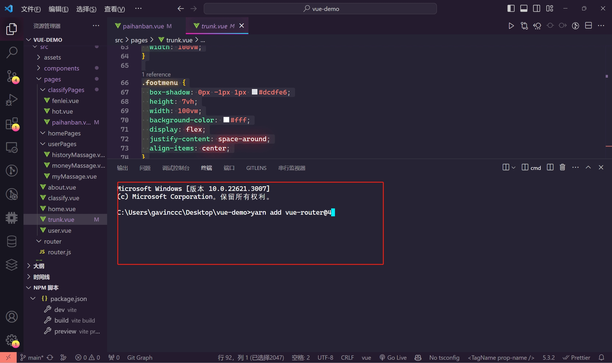

**2.编写router.js文件并全局引入router.js**

在src目录新建应该router目录并在该目录创建router.js文件
在里面写入以下代码
```JavaScript
import { createRouter, createWebHistory } from 'vue-router';

const router = createRouter({
  history: createWebHistory(),
  routes: [
    {
      path: '/',
      name: '',
      redirect: '/home',
    },
    {
      path: '/home',
      name: 'home',
      component: () => import('../pages/home.vue'),
      meta: {
        home: true,
      },
    },
  ],
});

export default router;
```

有人问为什么要这么写，这里不做过多阐述，需要了解的请点上面的链接进router官网学习

点开main.js，添加以下代码
```JavaScript
import router from './router/router.js';
createApp(App).use(router).mount('#app');
```
其中createApp(App).mount('#app');原本就有了，只需要加入.use(router)即可

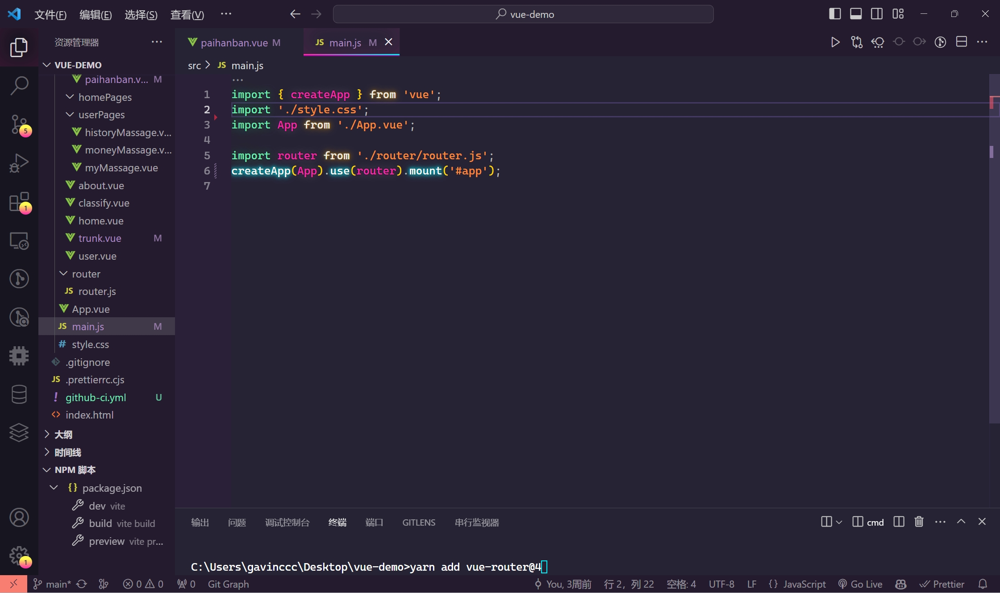

这样子，页面首先就会跳到home界面了

我们现在要实现4个界面，分别是首页，分类，推荐，我的
我们分别在pages目录创建home.vue,classify.vue,about.vue,user.vue并在里面编写内容

然后在router.js加入这些页面的路由

以下是完整的router.js

```JavaScript

import { createRouter, createWebHistory } from 'vue-router';

const router = createRouter({
  history: createWebHistory(),
  routes: [
    {
      path: '/',
      name: '',
      redirect: '/home',
    },
    {
      path: '/home',
      name: 'home',
      component: () => import('../pages/home.vue'),
      meta: {
        home: true,
      },
    },
    {
      path: '/user',
      name: 'user',
      component: () => import('../pages/user.vue'),
      meta: {
        user: true,
      },
    },
    {
      path: '/classify',
      name: 'classify',
      component: () => import('../pages/classify.vue'),
      meta: {
        classify: true,
      },
    },
    {
      path: '/about',
      name: 'about',
      component: () => import('../pages/about.vue'),
      meta: {
        about: true,
      },
    },
  ],
});

export default router;
```

**3.在trunk中加入跳转函数**

```JavaScript
<template>
  <div class="main">
    <router-view></router-view>
  </div>
  <div class="foot" v-show="!$route.meta.childrenPage">
    <div class="footmenu">
      <span @click="goToHome">首页</span>
      <span @click="goToClassify">分类</span>
      <span @click="goToAbout">推荐</span>
      <span @click="goToUser">我的</span>
    </div>
  </div>
</template>

<script>
import Icon from '../components/Icon.vue';
export default {
  name: 'Trunk',
  components: {
    Icon,
  },
  data() {
    return {
      isActive: 1,
    };
  },
  methods: {
    goToUser() {
      this.$router.push('/user'); 
    },
    goToHome() {
      this.$router.push('/home');
    },
    goToClassify() {
      this.$router.push('/classify');
    },
    goToAbout() {
      this.$router.push('/about');
    },
  },
};
</script>

<style scoped>
.main {
  height: 93vh;
  width: 100vw;
}

.footmenu {
  box-shadow: 0px -1px 1px #dcdfe6;
  height: 7vh;
  width: 100vw;
  background-color: #fff;
  display: flex;
  justify-content: space-around;
  align-items: center;
}

span {
  width: 25%;
  height: 100%;
  line-height: 400%;
}
</style>
```

>这里的<router-view></router-view>就是可更换区域，点击我的就会将user.vue的内容放在这里面来，其他的亦是如此

预览一下



oky已经完成了！

### 组件

这里不做过多赘述

写在components目录下的文件即为组件
需要注意的是


>例子：
我封装了一个头部导航栏可以循环复用
我可以在其他页面使用，比如在首页和分类以及推荐都加上这个组件


## ElementsPlus的引入与使用

前端的大力发展也使的各种ui组件库层出不穷，什么是组件库？




大家可以去Element的官网查看文档



### Elements的引入（全局引入）

在项目终端输入命令以导入Element



<!-- tab yarn -->

```
yarn add element-plus
```

<!-- endtab -->

<!-- tab npm -->

```
npm install element-plus --save
```

<!-- endtab -->



在main.js文件中加入以下代码
```JavaScript
import ElementPlus from 'element-plus'
import 'element-plus/dist/index.css'

app.use(ElementPlus)
```

现在我们的main.js如下
```JavaScript
import { createApp } from 'vue'
import './style.css'
import ElementPlus from 'element-plus'
import 'element-plus/dist/index.css'
import App from './App.vue'

import router from './router/router.js'
createApp(App).use(router).use(ElementPlus).mount('#app')
```

现在，我们就可以在任意一个文件中使用Element了

### Element的使用

我们需要一边浏览Element的组件文档一边使用Element组件



比如我使用一个element的button组件

我在官方文档查看代码，直接在需要的地方直接写进去

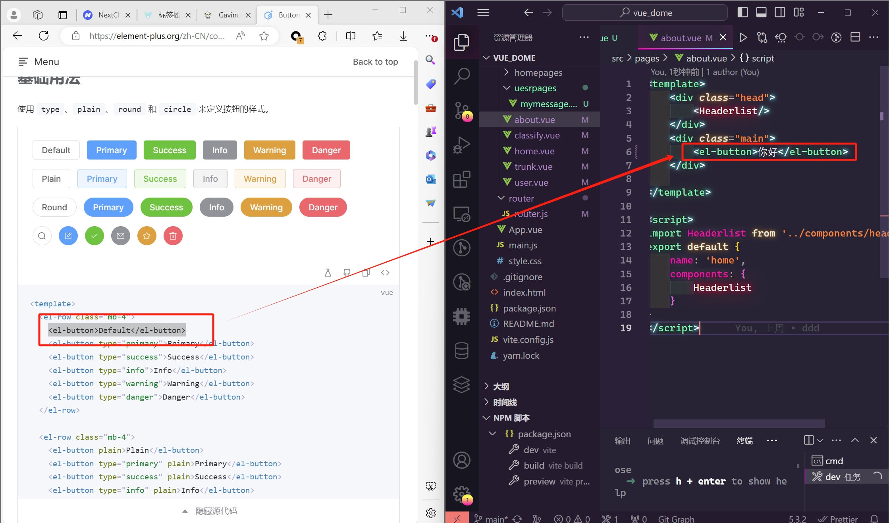

让我们看看预览效果



成功！

其他组件，按需求使用即可

## iconfont的引入与使用

前端的工程避免不了使用到各种各样的图标，因此网上的图标库也是非常丰富的，比较著名的有fontawsome，其中iconfont是阿里巴巴图标库，是国内最大的图标库

本工程图标库使用iconfont作为图标库



首先在官网登录后点开我的项目

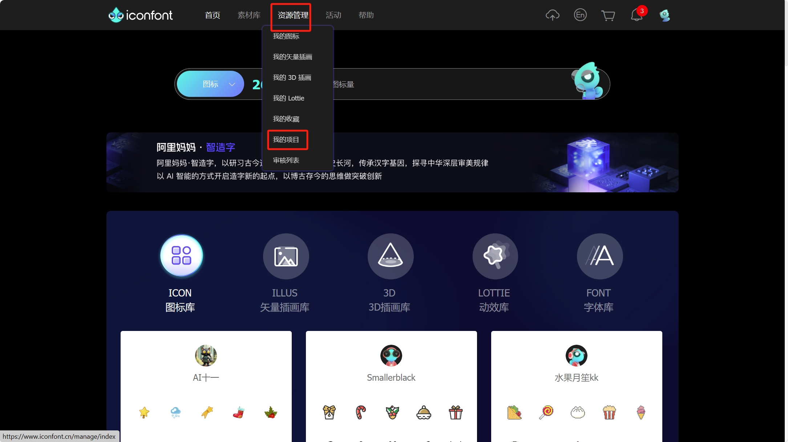

新建一个项目

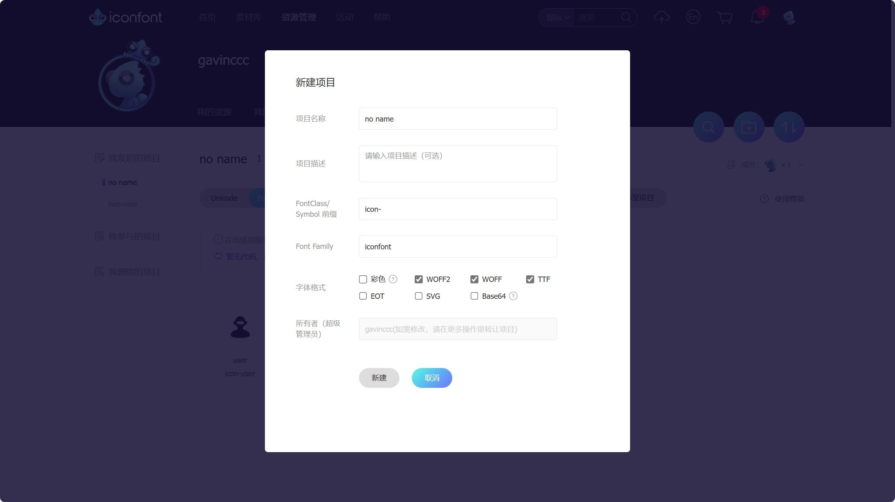

名字随便起，尽量英文

随后在右上角的搜索栏搜索需要的图标，英文搜索最好，在这里我们搜索一下user

可以看到有非常非常多的图标

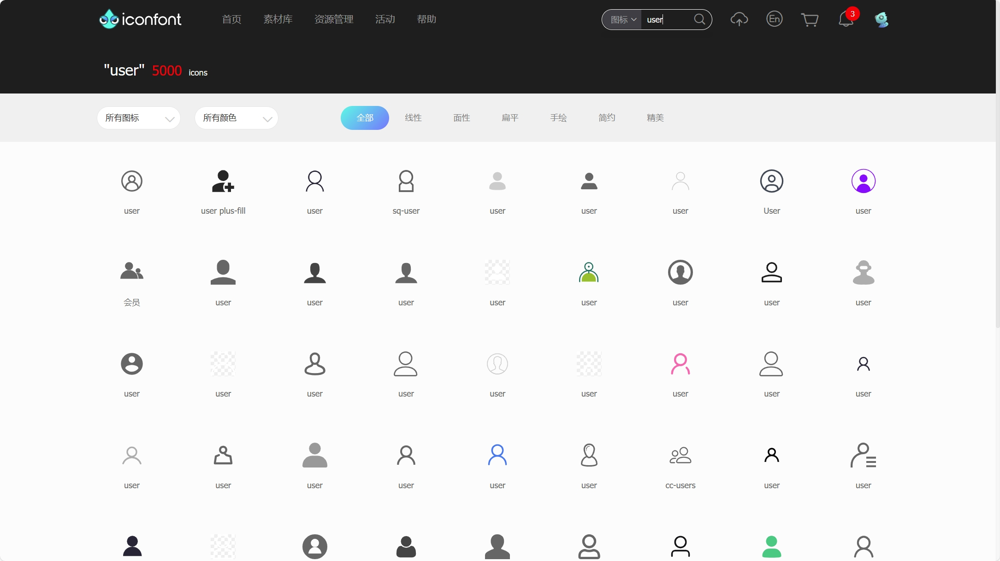

选择好之后将鼠标悬浮点击购物车图标

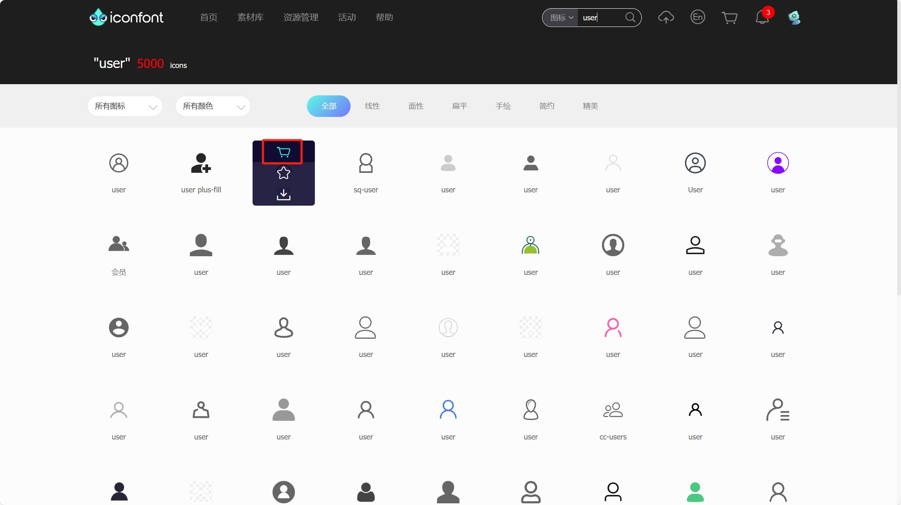

选择好几款（可以再次搜索多选择几个）点击右上角购物车图标，随后点击添加到项目

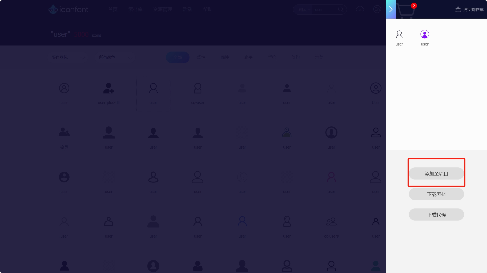

选择刚刚创建好的项目

根据图片的步骤生成代码，记得打开在线链接

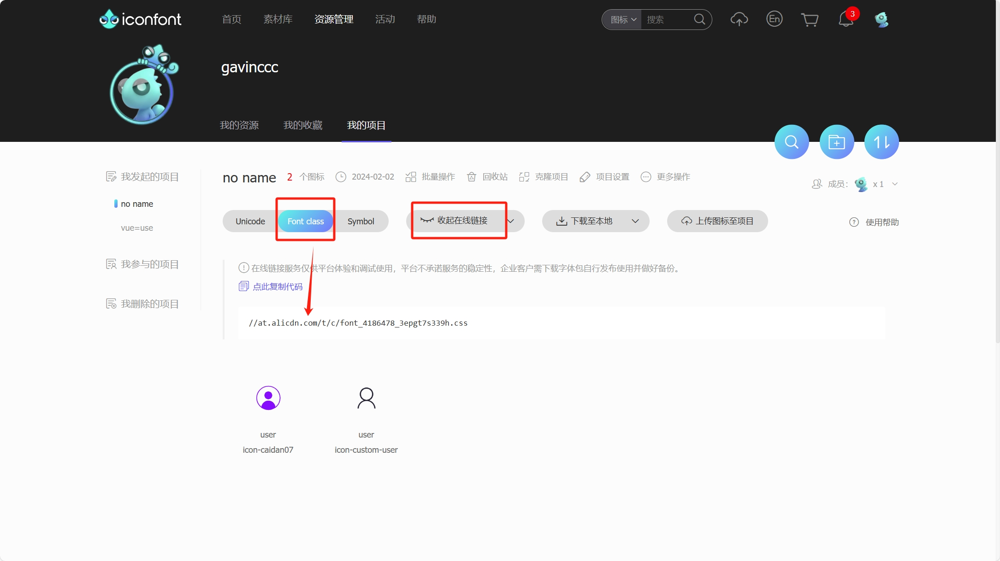

复制这个代码即可

在components目录新建icon.vue

并输入以下代码
```JavaScript
<template>
    <i class="iconfont" :class="[iconclass, extraclass]"></i>
  </template>
  
  <script>
  var map = {
    user: 'icon-caidan07',
    user1：'icon-custom-user'
  };
  export default {
    props: {
      type: {
        type: String,
        required: true,
      },
      extraclass: {
        type: String,
        default: '',
      },
    },
    computed: {
      iconclass() {
        return map[this.type];
      },
    },
  };
  </script>
  
  <style scoped>
    {/* 输入自己的项目代码 */}
  @import '//at.alicdn.com/t/c/font_4186478_3epgt7s339h.css';
  </style>
```
这里的map对象就是一个映射，将右边的字符串赋值给左边的变量，右边的字符串里面需要填写iconfont的代码

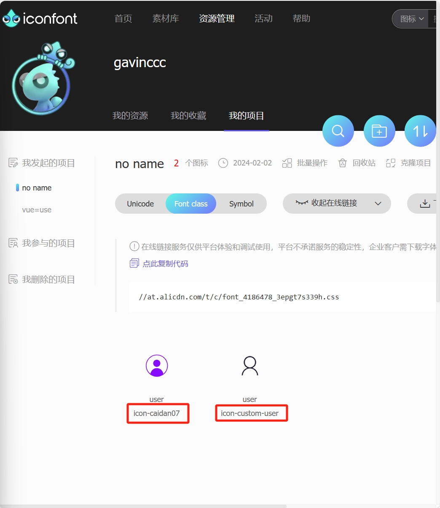

左边随意取名，这样，在其他页面使用时就填左边自己取名的变量即可

这样就打包好了一个icon组件，使用也非常简单

比如就在刚刚的about界面里面使用

```JavaScript
<template>
    <div class="head">
        <Headerlist/>
    </div>
    <div class="main">
        <el-button>你好</el-button>
        <Icon type="user1" extraclass="icon"/>
    </div>
    
</template>

<script>
import Headerlist from '../components/header.vue'
import Icon from '../components/Icon.vue';
export default {
    name: 'home',
    components: {
        Headerlist,Icon
    }
}
</script>

<style scoped>
.icon{
    font-size: 30px;
}
</style>
```
这里Icon的type就是刚刚在icon组件定义的变量，对应着iconfont的图标
还可以使用extraclass定义类名在父组件修改样式

预览效果



这样我们的icon就这样完结了


## 模板语法的使用  

根据前面的章节，很多人会觉得，vue似乎有许多功能都木有使用出来，很正常

**但实际上，我也说过，我要教会大家基本能够开发前端小工程，然而一些基本的vue知识如果没有的话，的确时不可行的**


以下是我学习vue时的学习视频，我的课程也是依此来构建的，大家学习vue时，按照自己的需求来挑选视频，适合自己的才是最好的   


好的，正式开始我们的vue的模板语法教程

事实上我只教一个语法

>data值在vue中的调用

正常的一个vue文件是这样的

```JavaScript
<template>
    <h1 id="name">李白</h1>
    <h2 id="number">1110909098</h2>     
</template>

<script>

</script>

<style>

</style>
```


在常规的JavaScript中我们是怎么做的呢？

```javascript
<template>
    <h1 id="name">李白</h1>
    <h2 id="number">1110909098</h2>     
</template>

<script>
// 创建一个 JavaScript 对象
let person = {
    name: "李白",
    number: 1110909098,
};

// 获取 h1 标签元素
let h1Element = document.getElementById("name");
let h2Element = document.getElementById("number");

// 将对象的 name 值设置为 h1 标签的文本内容
h1Element.textContent = person.name;
h2Element.textContent = person.number;
</script>

<style>

</style>
```





以下就是vue的演示

```js
<template>
    <h1 id="name">{{ name }}</h1>
    <h2 id="number">{{ number }}</h2>     
</template>

<script>
export default {
    data() {
        return {
            name: '李白',
            number: 1110909098
        }
    }
}
</script>

<style>

</style>
```

很明显，无论是可读性还是实用性，vue都遥遥领先

还有！还有两处地方调用变量时会使用vue特性，分别是html标签头和script标签内部

在这里我直接一次性展示完了
```javascript
<template>
    <h1 id="name">{{ name }}</h1>
    <h2 id="number" :style="{color:color}">{{ number }}</h2>
    <button @click="changeColor">改变颜色</button>
    <intput :type="type" v-model="name"/>  
</template>

<script>
export default {
    data() {
        return {
            name: '李白',
            number: 1110909098,
            color: 'red',
            type: 'text'
        }
    },
    methods: {
        changeColor() {
            this.color = 'blue'
        }
    }
}
</script>

<style>

</style>
```
模板语法篇展示完毕


## v-for循环

现在你是程序猿，我给你一个需求，这个需求是，我要你做一个卡片，里面是一个照片，卡片的数量取决于客户上传的照片数量，你会怎么做？

由于数量不是固定的，写死的做法一定不行，如下面这个，一定会被领导骂死
```html
<!DOCTYPE html>
<html lang="en">
<head>
    <meta charset="UTF-8">
    <meta name="viewport" content="width=device-width, initial-scale=1.0">
    <title>Dynamic Elements</title>
</head>
<body>
    <div id="container"></div>
    <div id="container"></div>
    <div id="container"></div>
    <div id="container"></div>
    <div id="container"></div>
    <div id="container"></div>
    <div id="container"></div>
    <div id="container"></div>
    <div id="container"></div>
    <div id="container"></div>
    <div id="container"></div>
    <div id="container"></div>
    <div id="container"></div>
    <div id="container"></div>
</body>
</html>
```

聪明的你一定想得到使用js完成动态创建即可，如下面的代码
```html
<!DOCTYPE html>
<html lang="en">
<head>
    <meta charset="UTF-8">
    <meta name="viewport" content="width=device-width, initial-scale=1.0">
    <title>Dynamic Elements</title>
</head>
<body>
    <div id="container"></div>

    <script>
        const container = document.getElementById('container');
        const numElements = 10; // 这里可以根据需要设置元素的数量

        for (let i = 0; i < numElements; i++) {
            const div = document.createElement('div');
            const img = document.createElement('img');
            div.appendChild(img);
            container.appendChild(div);
        }
    </script>
</body>
</html>
```

很不错，可以使用简单的js循环完成构建，不过呢，在vue中，我们不需要再在js中写这些代码，可以直接在html中使用for循环
```html
<template>
    <div>
        <div id="container" v-for="item in datalist" :key="item.id">
            
            <h2>{{ item.name }}</h2>
        </div>
    </div>
</template>

<script>
export default {
    data() {
        return {
            datalist:[
                {id:1,src:'../assets/img/1.jpg',name:'李一'},
                {id:2,src:'../assets/img/2.jpg',name:'李二'},
                {id:3,src:'../assets/img/3.jpg',name:'李三'},
                {id:4,src:'../assets/img/4.jpg',name:'李四'},
                {id:5,src:'../assets/img/5.jpg',name:'李五'},
                {id:6,src:'../assets/img/6.jpg',name:'李六'},
                {id:7,src:'../assets/img/7.jpg',name:'李七'},
                {id:8,src:'../assets/img/8.jpg',name:'李八'},
                {id:9,src:'../assets/img/9.jpg',name:'李九'},
                {id:10,src:'../assets/img/10.jpg',name:'李十'},
                {id:11,src:'../assets/img/11.jpg',name:'李十一'},
                {id:12,src:'../assets/img/12.jpg',name:'李十二'},
                {id:13,src:'../assets/img/13.jpg',name:'李十三'},
                {id:14,src:'../assets/img/14.jpg',name:'李十四'},
                {id:15,src:'../assets/img/15.jpg',name:'李十五'},
            ]
        }
    },
}
</script>

<style>

</style>
```
在这里面，我们使用循环绑定了datalist数组，将其图片路径绑定在img标签的src上，再将数组中的name绑定再h1标签值里，这样，客户上传多少图片和名字，我们都可以将图片路径传至datalist数组中，这样就实现了动态的循环元素

这里的**item in datalist**是将datalist数组绑定于item，这样在循环的元素中使用datalist的值就用item.值即可（如上面的代码所示）


>性能优化：key 属性帮助 Vue 识别每个列表中的元素，从而在更新 DOM 时更高效地定位和更新元素，减少不必要的 DOM 操作，提高性能。

>唯一性：key 属性确保每个循环生成的元素具有唯一的标识符，避免出现相同 key 值导致的渲染问题。

>追踪变化：通过 key 属性，Vue 能够准确地追踪每个元素的变化，确保在列表数据发生变化时正确更新 DOM。

>复用元素：key 属性还有助于 Vue 识别元素之间的关系，以便在可能的情况下尽可能地复用已存在的 DOM 元素，而不是销毁和重新创建。



## 组件传值


很多时候，我们会将一些复用性高的元素组件化，比如我们将上面v-for循环部分的代码组件化我们就会发现一个问题（以下称之为card组件）
- 如果我在home界面使用这个card组件（可能是为了统一卡片风格）home页面可能是为了摆放热门照片
- 然后我们又在user页面使用这个card组件，user界面一般是是摆放个人照片  


我们需要肯定不是这样，我们需要的是每一个页面都是由每个页面自己决定的，这个时候我们就需要在父组件中将值传给子组件了


**那么，怎么传值呢？**
答案就是使用vue的props属性，让我们来看看最简单的使用
```js
<template>
  <div>
    <ChildComponent :message="parentMessage" />
  </div>
</template>

<script>
import ChildComponent from './ChildComponent.vue';

export default {
  components: {
    ChildComponent
  },
  data() {
    return {
      parentMessage: 'Hello from Parent!'
    };
  }
}
</script>

// ChildComponent.vue
<template>
  <div>
    <p>{{ message }}</p>
  </div>
</template>

<script>
export default {
  props: {
    message: String // 指定 message 的类型为字符串
  }
}
</script>
```

知道怎么使用了吧，让我们依此来完善我们的card组件
 
已知，我们card需要的是数组属性
直接来吧


<!-- tab card.vue -->
```js
<template>
    <div>
        <div id="container" v-for="item in datalist" :key="item.id">
            
            <h2>{{ item.name }}</h2>
        </div>
    </div>
</template>

<script>
export default {
    props: {
        datalist: {
            type: Array,
            default: () => []
        }
    }
}
</script>

<style>
.container {
    height: 100px;
    width: 100px;
    border: 1px solid #000;
    margin: 10px;
    display: inline-block;
    text-align: center;
    padding: 10px;
    box-sizing: border-box;
    img{
        width: 80%;
        height: 80%;
    }
}
</style>
```
<!-- endtab -->

<!-- tab home.vue -->

```js
<template>
    <div class="head">
        <Headerlist/>
    </div>
    <div class="main">
        <!-- <livecard :datalist="alist" ></livecard> -->
        <card :datalist="blist"></card>
    </div>
    
</template>

<script>
import livecard from '../components/livecard.vue'
import Headerlist from '../components/header.vue'
import exmaple from '../components/card.vue'
export default {
    name: 'home',
    components: {
        Headerlist,livecard,card
    },
    data(){
        return{
            // alist:[
            //     {
            //         id:1,
            //         imgurl:'https://element-plus.org/images/element-plus-logo.svg',
            //         title:'element-plus',
            //         tag:'vue3.0',
            //         space:'kuaile',
            //         yanse:'success'
            //     }
            // ],
            blist:[
                {id:1,src:'../assets/img/1.jpg',name:'李一'},
                {id:2,src:'../assets/img/2.jpg',name:'李二'},
                {id:3,src:'../assets/img/3.jpg',name:'李三'},
            ]
        }
    }
}
</script>
```

<!-- endtab -->

<!-- tab user.vue -->

```js
<template>
    <span class="span"><el-button @click="gomessage">我的信息</el-button></span>
    <card :datalist="clist"></card>
</template>

<script>
import exmaple from '../components/card.vue'
export default {
    components: {
        card
    },
    name: 'mymessage',
    methods:{
        gomessage(){
            this.$router.push('/user/mymessage')
        }
    },
    data(){
        return{
            clist:[
                {id:1,src:'../assets/img/6.jpg',name:'李六'},
                {id:2,src:'../assets/img/7.jpg',name:'李七'},
                {id:3,src:'../assets/img/8.jpg',name:'李八'},
                {id:4,src:'../assets/img/9.jpg',name:'李九'},
            ]
        }
    }
}
</script>

<style scoped>
.span{   
    border: 2px solid #000;
    color: #000;
}
</style>
```

<!-- endtab -->



让我们来看一下效果



<!-- tab home页面效果 -->



<!-- endtab -->

<!-- tab user页面效果 -->



<!-- endtab -->



因为我并没有放真实的图片，大家将就着看

在icon篇也是使用了组件传值的原理

最后献上我的真实的livecard以供大家参考



<!-- tab livecard.vue -->

```js
//记住是全局引入了element的
<template>
    <div class="body">
        <div class="main" v-for="item in datalist" :key="item.id">
            <div class="left">
                <div class="image">
                    
                </div>
            </div>
            <div class="right">
                <div class="text">
                    <div><h3>{{ item.title }}</h3></div>
                    <div class="tagfather"><el-tag class="ml-2 tagnew" :type="item.yanse">{{ item.tag }}</el-tag></div>
                </div>
                <div class="space">
                    <h4>{{ item.space }}</h4>
                </div>
            </div>
        </div>
    </div>
</template>

<script>
export default {
    name: 'livecard',
    props: {
        datalist: {
            type: Array,
            default: () => []
        }
    }
}
</script>

<style scoped>
.main{
    width: 100vw;
    height: 100px;
    border: 1px solid #000;
}
.left{
    width: 30%;
    height: 100px;
    float: left;
    border: 1px solid #000;
}
.right{
    width: 70%;
    height: 100px;
    float: left;
}

.image img{
    width: 100px;
    height: 90px;
    object-fit: cover;
}
.text{
    width: 100%;
    height: 50px;
    position: relative;
}
.text h3{
    position: absolute;
    top: 15%;
    left: 5%;
    font-size: 20px;
}
.space{
    width: 100%;
    height: 50px;
    position: relative;
}
.space h4{
    position: absolute;
    top: 15%;
    left: 5%;
    font-size: 17px;
}
.tagnew{
    position: absolute;
    top: 15%;
    right: 5%;
    padding: 0 10px;
    border: none;
    cursor: pointer;
}
</style>
```

<!-- endtab -->

<!-- tab home.vue -->

```js
<template>
    <div class="head">
        <Headerlist/>
    </div>
    <div class="main">
        <livecard :datalist="alist" ></livecard>
    </div>
    
</template>

<script>
import livecard from '../components/livecard.vue'
import Headerlist from '../components/header.vue'
export default {
    name: 'home',
    components: {
        Headerlist,livecard
    },
    data(){
        return{
            alist:[
                {
                    id:1,
                    imgurl:'https://element-plus.org/images/element-plus-logo.svg',
                    title:'element-plus',
                    tag:'vue3.0',
                    space:'kuaile',
                    yanse:'success'
                }
            ]
        }
    }
}
</script>
```

<!-- endtab -->

<!-- tab home页面预览效果 -->



<!-- endtab -->



## 路由跳转的进阶使用

### meta的使用

根据，我们上面的路由篇。为我们可以使用并创建简单的路由跳转，但是同时我们也会陷入一个难题，比如微信，下面的导航栏确实是作用域范围最广的组件，但是它却并不是全作用域，我们点开朋友圈，点开朋友的聊天界面，点开我们的设置界面，都会发现，下面的导航栏消失了，这很正常，非常符合我们的逻辑需求，然而对于前面的学习，似乎有点懵了，似乎下面的主导航栏已经成为必不可少或者说我们无法令其消失。

很显然，我的教程并不能让大家做到，好吧，我的问题

不过也不难，使用简单的v-if或v-show语句即可(什么？v-if和v-show你不知道是什么？百度哈)

以下是路由跳转的进阶使用和小技巧

让我们来看一下逻辑

首先界面是这样的


一个基础的"我的"界面，其中有"我的信息"按钮，点进去可以看到个人详细信息
>很明显，当我点击这个按钮时，下方的导航栏应该消失，取而代之的是上方出现返回按钮，对于这个界面，作用域范围最广的组件就是上方的返回导航栏

那么得知这个概念，我们就要动手了，该怎么做？



让我们关注到之前写路由文件router.js时写的一个属性**meta**

官网对它的解释时这样的




不知道大家有没有看懂，反正我没有，简而言之，就是router的一个属性，可以将其当作正常的对象的一个属性来使用，其次，由于router我们全局注册了，因此这个属性我们也可以全局使用

我们是这么写router的

```js
    {
      path: '/home',
      name: 'home',
      component: () => import('../pages/home.vue'),
      meta: {
        home: true,
      },
    }
```

>值得注意的是,这个属性在这里是一个布尔值，它为true的条件是当前的路由为/home，意思就是当前页面是什么路由，哪个的meta就为true  

因此我们只要检测路由不是"首页","分类"，"推荐"，"我的"四个界面即可，我们可以给所有在其之下的页面的meta取名为同样的名字，如childrenPage(子页面)，随后我们检测childrenPage的meta值，当其为true时，将下方导航栏的显示取消，当其为flase时，将其显示  
```js
    {
      path: '/user/myMassage',
      name: 'myMassage',
      component: () => import('../pages/userPages/myMassage.vue'),
      meta: {
        childrenPage: true,
      },
    },
    {
      path: '/user/historyMassage',
      name: 'historyMassage',
      component: () => import('../pages/userPages/historyMassage.vue'),
      meta: {
        childrenPage: true,
      },
    },
    {
      path: '/user/moneyMassage',
      name: 'moneyMassage',
      component: () => import('../pages/userPages/moneyMassage.vue'),
      meta: {
        childrenPage: true,
      },
    },
```

如果是在原生js中，这一步可能又要费许多功夫，但是在vue里面的v-if和v-show非常轻松的帮我们解决了这一痛点

他们的共同点，当条件为假时，页面上不会显示该元素标签
使用方法如下

```html
<div v-if="a == 1">HELLO</div>
<div v-show="a == 1">HELLO</div>
```
当变量a不等于1时，该div不会被显示出来



详情查看官网


这个时候，我们找到我们下方导航栏的位置，写入这个代码**v-show="!$route.meta.childrenPage"**
```js
<template>
  <div class="main">
    <router-view></router-view>
  </div>
  <div class="foot" v-show="!$route.meta.childrenPage">
    <div class="footmenu">
      <span @click="goToHome"><Icon type="shouye" extraclass="icon" :class="{ iconActive: isActive == 1 }" /></span>
      <span @click="goToClassify"><Icon type="fenlei1" extraclass="icon" :class="{ iconActive: isActive == 2 }" /></span>
      <span @click="goToAbout"><Icon type="tuijian" extraclass="icon" :class="{ iconActive: isActive == 3 }" /></span>
      <span @click="goToUser"><Icon type="user" extraclass="icon" :class="{ iconActive: isActive == 4 }" /></span>
    </div>
  </div>
</template>
```
看看效果


下方导航栏成功消失
后续出现这些情况都可以照葫芦画瓢了

### params的使用

博主写到这有点难受，随便写写吧

params也是vue-router的属性之一，使用它可以创建动态路由



>有的时候，我们需要点击一个按钮，进入子路由，随后显示页面，但是会出现一种情况，如美团的美食界面，很明显都是一样的，只是图片和买哦书有所不同，但是我们会发现，本来它的美食列表就是循环实现的，怎么才能点击进入新路由还可以使用同一个组件呢，使用同一个组件简单，可是我们的router只能有一个，不可能全部美食都是一个路由吧  

**这个时候就需要我们的动态路由了，可以实时创建路由**

这个东西确实对小白不太好描述，因此，我们直接通过一些简单的例子来学习

这个是我们的列表页



其router.js如下

```js
        {
            path: "/diet",
            name: "diet",
            component: () => import("../diet/diet.vue"),
        }
```
使用了vue-for循环实现了列表的效果，接下来是需要点击不同的卡片进入不同的界面(可以说是相同的界面，当时数据是不同的)
效果如下



<!-- tab 乌鸡汤 -->



<!-- endtab -->

<!-- tab 酸梅汤 -->



<!-- endtab -->



可以看到，除了数据不同，其余样式均一样，因此我们实现这个效果一定是使用了同一个组件
巧妙的是，我们路由的显示，又是不一样的，一个是**localhost:5173/diet/虫花草乌鸡汤**，一个是**localhost:5173/diet/酸梅汤**
和我们之前不一样，我们之前的写法只能够一个路由匹配一个组件，现在，我们实现了多个路由匹配一个组件

我们来看一下这个组件的router是怎么写的

```JS
{
    path:'/diet/:herbsName',
    name:'herbsPage',
    component:()=>import('../components/herbs.vue'),
    meta:{
        childrenPage:true
    },
}
```
和以往不同，这次的path在**herbsName**前面加了一个:
这是动态路由的意思，加上:,这个路由就变成了动态的，可以在任何界面操控，赋予任何的值，相当于一个全局变量

>知道了这些之后，我们可以这么做，在父组件点击哪个卡片，就跳转组件，同时，将herbsName这个动态这个路由赋值为卡片的名称
>随后，我们可以在子组件中读取该路由的值（herbsName），在data部分(data在工程中由后端数据库提供，在这里我们导入json文件当作后端)寻找相对应的对象集，将对象集中的数据放在子组件上显示即可

首先，我们看一下父组件的源代码
```html
<template>
    <div class="cll">
        <div class="remen" v-for="item in dietlist" :key="item.id" @click="redirectToPage(item.name)">
            <div class="img">
                
            </div>
            <div class="text">
                <div class="zt1">
                    <div class="m"><h3>{{ item.name }}</h3></div>
                    <div class="leibie"><van-tag :type="item.color" class="sss"> {{ item.leibie }}</van-tag></div>
                </div>
                <div class="zt2"><p>{{ item.gonxiao }}</p></div>
            </div>
        </div>
        <van-back-top bottom="10vh"/>
    </div>
</template>

<script>
import { Tag,BackTop } from 'vant';
export default {
    components: {
        vanTag:Tag,
        vanBackTop:BackTop
    },
    props:{
        dietlist:{
            type: Array,
            required: true,
        },
    },
    methods:{
        redirectToPage(itemName) {
        // 根据卡片的id进行页面跳转
        // 使用Vue Router的例子
        this.$router.push({ name: 'herbsPage', params: { herbsName:itemName } });
        },
    }
}
</script>
```

核心在于
```js
redirectToPage(itemName) {
  // 根据卡片的id进行页面跳转
  // 使用Vue Router的例子
  this.$router.push({ name: 'herbsPage', params: { herbsName:itemName } });
  }
```
该函数实现了跳转至名为**herbsPage**的页面组件的同时将params属性进行修改，将**herbsName**赋值为通过函数传入的**itemName**,在这里，itemName也就是卡片的名称（乌鸡汤、酸梅汤等）

接下来我们来看看子组件的源代码,为避免出现不理解的问题，我将json文件也一起放出来



<!-- tab 子组件源代码 -->

```html
<template>
    <Header :title="selectedObject.name"/>
    <div class="main">
        <div class="head">
            <span>{{ selectedObject.name }}</span>
        </div>
        
        <div class="cook">
            <span class="listname"><Icon type="leaf" extraclass="icon"/>食材</span>
            <div class="listtext">{{ selectedObject.material }}</div>
        </div>
        <div class="cook">
            <span class="listname"><Icon type="cook" extraclass="icon"/>做法</span>
            <ol>
                <li class="listtext" v-for="(step, index) in cookSteps" :key="index">{{ step }}。</li>
            </ol>
            <video :src="selectedObject.video" controls></video>
        </div>
        <div class="cook">
            <span class="listname"><Icon type="list" extraclass="icon"/>功效</span>
            <div class="listtext">{{selectedObject.gonxiao}}</div>
        </div>
        <div class="cook">
            <span class="listname"><Icon type="warning" extraclass="icon"/>禁忌</span>
            <div class="listtext">{{ selectedObject.taboo }}</div>
        </div>
        <div style="height: 30px;"></div>
    </div>
</template>

<script>
import Icon from './icon.vue'
import jsonData from '../json/herbslist.json'
import Header from './backHead1.vue'
export default {
    components: {
        Header,Icon
    },
    data(){
        return{
            selectedObject: {},
        }
    },
    computed: {
        cookSteps() {
            if (this.selectedObject.cook) {
                return this.selectedObject.cook.split('。').filter(step => step.trim() !== '');
            }
            return [];
        }
    },
    created(){
        this.loadCardData();
    },
    methods: {
        loadCardData() {
            const herbsName = this.$route.params.herbsName;
                // 你可以根据实际情况使用异步请求加载数据
            setTimeout(() => {
                    // 根据herbsName加载对应卡片的数据，这里只是示例
                let selectedObject = jsonData.find(obj => obj.name == herbsName);
                if (selectedObject) {
                this.selectedObject = selectedObject;
                } else {
                console.error('未找到匹配的对象');
                }
            }, 500); // 模拟异步加载的延迟
        },
    },
}
</script>
```

<!-- endtab -->

<!-- tab json文件 -->

```json
[
    {"id": 1,"value":"10", "name": "虫草花乌鸡汤", "gonxiao": "止血化痰·益肝补肾，养气补精", "img": "./wjt.jpg", "leibie": "汤类", "color": "primary", "video": "../wjt.mp4", 
    "material": "乌鸡1只，虫草花10克，姜片3片，料酒1汤匙，盐适量。",
    "cook": "1.乌鸡去毛、内脏、洗净，切块，用开水焯一下，捞出洗净。2.虫草花洗净，用开水焯一下，捞出洗净。3.将乌鸡块、虫草花、姜片、料酒放入砂锅中，加入适量清水，大火煮沸后转小火炖2小时。4.加入盐调味即可。",
    "taboo": "脾胃虚寒者、痰湿者不宜多食。"},
    {"id": 2,"value":"9", "name": "酸梅汤", "gonxiao": "除热送凉、生津止漏、祛痰止渴", "img": "./smt.jpg", "leibie": "汤类", "color": "primary", "video": "../smt.mp4",
    "material": "酸梅干10克，冰糖适量，水适量。",
    "cook": "1.酸梅干洗净，用开水焯一下，捞出洗净。2.将酸梅干放入砂锅中，加入适量清水，大火煮沸后转小火炖2小时。3.加入冰糖调味即可。",
    "taboo": "脾胃虚寒者、痰湿者不宜多食。"},
    {"id": 3,"value":"3", "name": "薄荷粥", "gonxiao": "疏散风热.清利咽喉", "img": "./bhz.jpg", "leibie": "粥类", "color": "success", "video": "../bhz.mp4",
    "material": "大米100克，薄荷叶10克，冰糖适量，水适量。",
    "cook": "1.大米淘洗干净，薄荷叶洗净。2.将大米、薄荷叶放入砂锅中，加入适量清水，大火煮沸后转小火炖2小时。3.加入冰糖调味即可。",
    "taboo": "脾胃虚寒者、痰湿者不宜多食。"},
    {"id": 4,"value":"6", "name": "金橘茶", "gonxiao": "消积止呕", "img": "./jjc.jpg", "leibie": "茶类", "color": "warning", "video": "../jjc.mp4",
    "material": "金橘1个，冰糖适量，水适量。",
    "cook": "1.金橘洗净，切片。2.将金橘片放入砂锅中，加入适量清水，大火煮沸后转小火炖2小时。3.加入冰糖调味即可。",
    "taboo": "脾胃虚寒者、痰湿者不宜多食。"},
    {"id": 5,"value":"16", "name": "人参酒", "gonxiao": "补气，活血驱寒", "img": "./rsj.jpg", "leibie": "酒类", "color": "danger", "video": "../rsj.mp4",
    "material": "人参10克，白酒500克。",
    "cook": "1.人参洗净，切片。2.将人参片放入瓶中，加入白酒，密封放置1个月即可。",
    "taboo": "脾胃虚寒者、痰湿者不宜多食。"},
    {"id": 6,"value":"18", "name": "金银花茶", "gonxiao": "清热解毒", "img": "./jyhc.jpg", "leibie": "茶类", "color": "warning", "video": "../jyhc.mp4",
    "material": "金银花10克，冰糖适量，水适量。",
    "cook": "1.金银花洗净。2.将金银花放入砂锅中，加入适量清水，大火煮沸后转小火炖2小时。3.加入冰糖调味即可。",
    "taboo": "脾胃虚寒者、痰湿者不宜多食。"},
    {"id": 7,"value":"1", "name": "蜂蜜柚子茶", "gonxiao": "清热解毒", "img": "./fmyzc.jpg", "leibie": "茶类", "color": "warning", "video": "../fmyzc.mp4",
    "material": "柚子1个，蜂蜜适量，水适量。",
    "cook": "1.柚子洗净，切片。2.将柚子片放入砂锅中，加入适量清水，大火煮沸后转小火炖2小时。3.加入蜂蜜调味即可。",
    "taboo": "脾胃虚寒者、痰湿者不宜多食。"}
]
```

<!-- endtab -->



在子组件源代码中，我们在生命周期函数中调用了**loadCardData**函数
```js
loadCardData() {
    const herbsName = this.$route.params.herbsName;
        // 你可以根据实际情况使用异步请求加载数据
    setTimeout(() => {
            // 根据herbsName加载对应卡片的数据，这里只是示例
        let selectedObject = jsonData.find(obj => obj.name == herbsName);
        if (selectedObject) {
        this.selectedObject = selectedObject;
        } else {
        console.error('未找到匹配的对象');
        }
    }, 500); // 模拟异步加载的延迟
}
```
该函数很简单，获取当前路由的**params**属性值，就是路由的**herbsName**值,随后将这个值在json中进行查找，并将该值所在的对象提取出来并赋给**selectedObject**，然后我们就可以对selectedObject随便操控了，接下来的事情就是一马平川了

ok了家人们


本文就此结束，有需要可以联系
邮箱：2084896301@qq.com
微信：wxcf9687