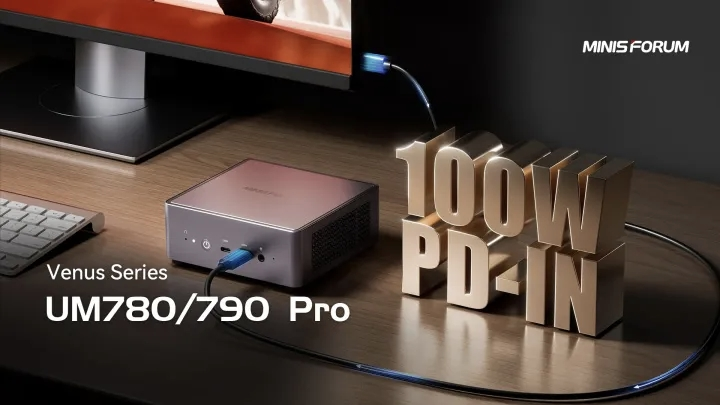
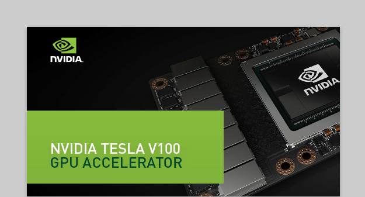
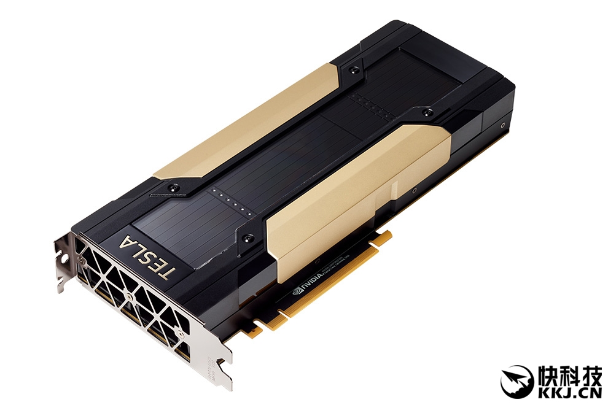

搞机的确是人生一大趣事（机器的机）

<!-- more -->

## **前言**

### **想法来源**

伙计们，我很早就有了外接显卡的想法，我的主机是铭凡的**7840hs小主机**（如下图），搭配**96g内存**和**2t固态**，该机器的核显780M非常强，约等于**1650labtop**的水平  

然而在一年多的使用下来，接触过的4090无论是ai还是游戏性能都让我对该机器食之无味，特别是使用该机器训练yolo竟然达到了10个小时之久（4090仅用时不到40min）于是萌生了外接显卡的想法  

当时就已经看过了各种外接显卡坞的测评，想法很早，实现确实推迟了很久  

### **实现契机**

为何迟迟不愿意购买，也是因为本人实在是钱包空空，动则几千元的显卡实在无法忍痛割手，故一直闲置该想法。  
直至今年6月末，我与师兄沟通硬件时意外得知**v100（nvidia的专业计算卡）**大船靠岸的消息，仅需**600不到**即可拿下，这可是理论性能达到**4060ti**的显卡阿，ai性能甚至是有过之而不及，于是果断下单  
  

## **v100的参数**

### **V100和4060TI的对比**

作为7年前的卡皇，它在理论性能上近乎完爆4060TI 16G

**V100 16G 性能：**

FP32 14TFLOPS，FP16 28TFLOPS，FP16-TensorCore 112TFLOPS，显存带宽900GB/s，5120个CUDA核心，HBM2显存

**4060TI 16G性能：**

FP16/32 22TFLOPS，FP16-TensorCore 88TFLOPS，显存带宽288GB/s，4352个CUDA核心，GDDR6显存  

V100的HBM2显存是和核心封装在一起的，带宽放在今天依然前列

在跑ai方面，没得说，但是游戏的话肯定还是geforce系列更加勇猛，仅玩游戏的话，也不是没有性价比，只是不是那么推荐

### **V100的接口**

在接口方面，大船靠岸的tesla v100基本都是服务器主板专用的sxm2接口版本的v100显卡，和我们消费级主机使用的主板的PCIE接口有很大不同（请看下图），所以还需要使用sxm2转pcie的转接板来正常使用

<!-- tab SXM2接口 -->

<!-- endtab -->

<!-- tab PCIE接口 -->

<!-- endtab -->
  

## **V100卖家和sxm2转pcie转接板选择**

### **V100卖家选择**

一开始师兄推荐了**南京海雀**，他和我说全网最低价，我一看**640** 
我不信，果然，我自己淘宝一搜，**广州壹玖580**，**上海瑞兴568还包邮**  
师兄果然太过信任他的b站推荐了（这个南京海雀说他全网最低价在B站上面）
还好我搜了一下，最后选择了广州壹玖，主要是近，我想快点体验到  
大家要是购买直接一波**上海瑞兴**，当时我搜的时候是全网最低价了  

### **sxm2转pcie转接板选择**

其实市面上有很多中方案，b站上有很多大哥做了教学，甚至pcb开源的都有

孰优孰劣倒也不好说，我是外接显卡坞的，理论上来说用最丐的就行（因为通道肯定跑不满）  

当时我主要在杀生丸和胡桃厨两家选择（如下图）


<!-- tab 杀生丸 -->

<!-- endtab -->

<!-- tab 胡桃厨 -->

<!-- endtab -->
  

这两个转接板别对应了两个散热方案，一个是涡轮散热，一个是4090散热器散热

由于涡轮实在是太吵了，而且htc支持开发票，所以果断选择了htc的4090散热器版本的转接板（md它第二天就降价100，我想拿刀捅他）

## **显卡扩展坞** 

选择了天钡的AG02  
支持usb4和oculink双接口
自带800w电源
可pd反向供电  

## **散热器选择拼装以及魔改**

### **散热器选择**

这就不必多言了，因为转接板对应了同德的4090散热器，所以直接买了同德的
买了无灯版本，有点亏，不是那么帅
还是带pcb的（无核心显存），需要的联系我  


<!-- tab 同德散热器 -->

<!-- endtab -->

<!-- tab 4090pcb -->

<!-- endtab -->
  

### **拼装**

全过程最艰难！没有之一！！！

主要是我当时买的时候没有做好充分的调研，谁知道显卡装上转接板之后和散热器如此不贴合呢，而且核心和均衡热板之间甚至有1.5mm的空隙！，难受阿！

可以看到我框起来的部分，被两个螺柱顶起来，这就是空隙来源  

为解决此问题，我用了三种方法，看我大显神通  

#### **前置准备**  

其实在解决空隙问题之前，还得解决v100显卡挡板问题，不然完全无法与散热器拼装，我没有看其他人的拼装视频，是我自己发现的这个问题  
也是我自己找到的解决方法 

可以看到我框起来的部分，这个挡板是用来固定核心与pcb的，但是挡住了我散热器连接，但是拆掉的话我又无法很好的与转接板固定  
所以我的方法是：**挪挡板到转接板背部，与v100显卡用螺丝拧紧**  

我真聪明，哈哈哈哈，其实要是我有足够品类的螺丝，足够长的，我都不用这么费劲，主要是就啥都没有，只能用显卡自带的和商家送的几个螺母  

#### **相变片填充空隙**

其实有了空隙之后我就挺崩溃的，实在难受，感觉白买了，毕竟这么多空隙相当于无散热  

为了填充这个空隙，我跑去实验室把以前的固态残留的相变片和硅脂全部拿了过来，不要命的涂和贴  

由于我当时贴好之后没有拍照，只有拆开后的一点视频，下面是拆开后的样子  

不仅有空隙未填充完毕，也十分的厚实，导热效率非常差劲  

但是我仍然用此使用了一段时间，打过游戏，问题不大  

烤鸡80多度，具体多少，实在是忘记了  

但是我对此是不满的，主要是丑陋……  

#### **硅胶片填充空隙**  

难受，后面的几乎都没拍什么照片  

因为前面实在是太丑了，所以我去淘宝买了个硅脂片（2mm厚度……  

  

额，没错直接贴了上去，但是电感由于在和均衡热板接触面积的外面，所以电感还是无法散热  

这套方案怎么说呢，几乎没有进步，烤鸡82度……

还被群友吊了一顿，说我神经吗，2mm厚是不是给核心盖被子  

我痛定思痛，祭出最后一招  

#### **紫铜片填充空隙**  

没错，依然没有拍照  

我依照群友的建议（他说用六个核桃剪点铁皮下来都比我硅脂2mm好）
所以我去淘宝买了个紫铜片，1.5mm厚度，同时买了铜箔，用于连接电感和均衡热板  


<!-- tab 紫铜片 -->

<!-- endtab -->

<!-- tab 铜箔 -->

<!-- endtab -->
  

这一套下来果然管用，直接就把烤鸡温度干到67度，电感mos管也成功散热，芜湖起飞~  

同时我用铜柱加高，使得背板平整（虽然厚度增厚了），功德圆满矣~  

## **V100图形驱动（WDDM模式）**

### **驱动安装**

直接去官网下载驱动即可，下载对应版本对应硬件的，懂自懂

如果你也win11，按我这样子就行  

 

点击查看然后下载下来，随后运行安装程序，一路点下一步即可，遇到报错就点是或者跳过

肯定没问题的  

安装完之后打开cmd运行nvidia-smi就可以看到以下：

  

我们可以发现，该卡运行在了TCC模式，这个是只能用来跑计算的模式，无法进行图形渲染，也就是无法游戏和生产力工作  

这个时候我们要改注册表  

### **改注册表使TCC模式改为WDDM模式**

首先我们要找到v100设置在注册表的位置，我们打开设备管理器，右键v100驱动，在属性位置点击驱动关键字，可以看到该值
*{4d36e968-e325-11ce-bfc1-08002be10318}\?*
除了问号应该都是一样的，同时记住亮机卡的关键字  

  

图中的amd 780 m是我的亮机卡（其实是核显） 

**在v100这个注册表中：** 
>将 **AdapterType** 改为 1
>将 **FeatureScore** 改为 D1
>新建32位值 **GridLicensedFeatures** 为 7
>新建32位值 **EnableMsHybrid** 为 1

**在亮机卡或核显这个注册表中：** 
>新建32位值 **EnableMsHybrid** 为 2  

  

随后在设备管理器点击禁用v100驱动 

  

然后再打开  
  

随后在cmd运行nvidia-smi，看到模式改为了wddm就成功了
  

也可以用任务管理器或者gpu-z查看，只有有了图形驱动才可以在任务管理器查看到
 

据说会有开机之后掉驱动的问题，需要在设备管理器再次启动，额，我没遇到过这个情况  

## usb4与oculink

一开始我是直接使用usb4的但是惊恐的发现带宽只有PCIE x2 ！！
带宽的上限决定许多东西无法正常运行，如游戏帧数始终有瓶颈，不论是最高画质还是最低画质，帧率几乎差不多，这根本不合理  

简单算一下，**pcie 3.0 x4** 大约是**32gbps**，满血usb4为**40gbps**，正常来讲是够的，但是其中**20gbps**左右被分去了视频输出信号，导致数据带宽只有**20gbps**左右，仅能跑满**pcie 3.0 x2**
what a pity！

受不了了，买一个m2转oculink延长线
 

把主机硬盘位用来装这个，启动！！

 

成功了，pcie带宽成功来到x4 
 

但是这样子有点丑，延长线卡在那里不适合成为这个主机固定接口，扩大主机面积和空间
我这样子的强迫症简直难受
于是呼叫椰蓉，开始搞机……

用水口钳在侧边入风口开了一个口，直接用螺丝固定在了侧边，perfect！！！

 

## **实际测试**

经过我实际的部分测试，一些数据如下：

>cs2平均帧150
无畏契约188帧
三角洲120帧
qwen3 14b 38token/s
烤鸡温度67度温度曲线平整不降频
黑神话悟空影视级画质65帧
地平线最高画质70帧（有误差，不知为何）

 