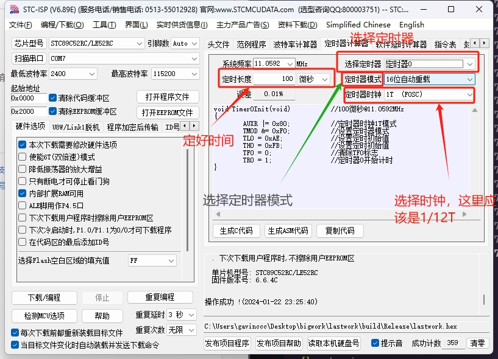

## c语言程序入门应用

### 关键字与数据类型


#include => 包含头文件  
**头文件预处理在源文件与编译器之间**  
#define => 宏定义  
一般在头部，将c中某关键字进行替换


>32个关键字，编译器预先定义了有一定物理意义的字符串 =>不同编译器有不>同的定义sizeof 也是关键字:查看变量在内存空间中容量的工具，用法sizeof(变量)通>过关键字定义的不同数据类型的变量，限制变量 (资源)的大小(e.g.4字节，2字节...)


c中的数据类型有明确规范，无论输入还是输出都要标明

>    %d 十进制有符号整数  
>    %u 十进制无符号整数  
>    %f 浮点数  
>    %s 字符串  
>    %c 单个字符  
>    %p 指针的值  
>    %e 指数形式的浮点数  
>    %x, %X 无符号以十六进制表示的整数  
>    %o 无符号以八进制表示的整数  
>    %g 把输出的值按照 %e 或者 %f 类型中输出长度较小的方式输出  
>    %p 输出地址符  
>    %lu 32位无符号整数  
>    %llu 64位无符号整数  
>    %% 输出百分号字符本身。   

>    除了格式化说明符之外，printf() 函数还支持一些标志和选项，用于控制输出的精度、宽度、填充字符和对齐方式等。  例如：
>    %-10s：左对齐并占用宽度为 10 的字符串；
>    %5.2f：右对齐并占用宽度为 5，保留两位小数的浮点数；
>    %#x：输出带有 0x 前缀的十六进制数。


### 局部变量、全局变量、静态变量
对于单一文件而言的:局部变量、全局变量、静态变量
>局部变量:定义在函数内部的变量=>代码块作用域
>全局变量:定义在函数外部的变量=>文件作用域
>静态变量:有static修饰的变量
有很多种组合，不需要都搞清楚，等遇到了再分析: where (可见性)?& static (生命周期)?

下面这个例子很好的展示了这一点并且展示了冒泡排序
**示例**
``` c
#include<stdio.h>

int main()
{
    int class[10];
    for (int i = 0; i < 10; i++) // 循环输入10次
    {
        scanf("%d",&class[i]);
    }
    printf("你输入了：");
    for (int j = 0; j < 10; j++) //遍历数组并输出
    {
        printf("%d ",class[j]);
    }
    for (int i = 0; i < 10; i++) //冒泡排序
    {
        for (int j = 0; j < 10; j++)
        {
            if (class[j+1]>class[j])
            {
                int null = class[j];
                class[j] = class[j+1];
                class[j+1] = null;
            }
        }
    }
    printf("\n");
    for (int j = 0; j < 10; j++) //遍历排序好的数组并输出
    {
        printf("排第%d的数是%d\n",j+1,class[j]);
    }
    
}
```
卧槽无语了，刚开始写的博客，这个代码应该是上一章节的


### 数组

例：char a[num]={……}

**当char中使用中文时，应该是二维数组**
```bash
char wday[7][7] = {"星期一","星期二","星期三","星期四","星期五","星期六","星期天"};
```

**注意事项**
>int a[]={……}; 可以在定义的时候给出初始值。可省略。  
>int b[][5]={...}; 同上，但是第二个不能省略  
>a[]=3; 这样做就不对了，里面没有定位，不能省略。  
>b[][2]=2; 同上，不能省略。 a[x]=3；这样做也对，但是要保证变量x的值正确。C不会自动给你查越界。


**以下例子很好的展示数组**
``` c
#include <stdio.h>

void  main()
{
    int tick = 0; //0~86399
    short mouth[12] = {31,29,31,30,31,30,31,31,30,31,30,31}; 
    short date; 
    short yue;
    short week; 
    char wday[][7] = {"星期一","星期二","星期三","星期四","星期五","星期六","星期天"};
    printf("请输入一个在 1~366 区间的数\n");
    scanf_s("%d", &tick); 
    week =  (tick+8)%7 ; //这个应该不会错的
    date = tick;
    for (int i = 0; i < 12; i++)  //依次遍历，一旦小于等于0，则该次遍历为月份
    {
      tick = tick - mouth[i];
      if (tick<=0){yue=i+1;break;};
    }
    for (int j = 0; j < yue; j++) //遍历之后获得减掉前面月份天数的值，即为当月日期
    {
      date= date-mouth[j-1];
    }
    printf("当前日期为: 20-%02d-%02d-%s\n", yue, date, wday[week]);  
}
```
### 枚举

说实话还是不太理解

枚举方法：

1、先定义枚举类型，再定义枚举变量
``` c
enum DAY
{
      MON=1, TUE, WED, THU, FRI, SAT, SUN
};
enum DAY day;
```
这里的DAY是枚举名

2、定义枚举类型的同时定义枚举变量
``` c
enum DAY
{
      MON=1, TUE, WED, THU, FRI, SAT, SUN
} day;
```

3、省略枚举名称，直接定义枚举变量
``` c
enum
{
      MON=1, TUE, WED, THU, FRI, SAT, SUN
} day;
```
可以使用typedef定义别名
``` c
typedef enum
{
      MON=1, TUE, WED, THU, FRI, SAT, SUN
} day;
day day1 day2;
```
其中day是这个枚举名的别名，提高代码可读性

下面这串代码很好的展示了枚举的应用

``` c
#include <stdio.h>
 
enum DAY
{
      MON=1, TUE, WED, THU, FRI, SAT, SUN
};
 
int main()
{
    enum DAY day;
    day = WED;
    printf("%d",day);
    return 0;
}
```

**枚举经常与switch一同使用**
下面的代码展示了这种情况
``` c
#include <stdio.h>
#include <stdlib.h>
int main()
{
 
    enum color { red=1, green, blue };
 
    enum  color favorite_color;
 
    /* 用户输入数字来选择颜色 */
    printf("请输入你喜欢的颜色: (1. red, 2. green, 3. blue): ");
    scanf("%u", &favorite_color);
 
    /* 输出结果 */
    switch (favorite_color)
    {
    case red:
        printf("你喜欢的颜色是红色");
        break;
    case green:
        printf("你喜欢的颜色是绿色");
        break;
    case blue:
        printf("你喜欢的颜色是蓝色");
        break;
    default:
        printf("你没有选择你喜欢的颜色");
    }
 
    return 0;
}
```
**补充**
>在所有教科书与c规范中，switch都是不允许case后接范围的，但是GNU C进行了扩展
>可以使用case min ... max这种用法表示范围（英文句号，前后有空格）

示例
``` c
#include<stdio.h>

int main(){
    int i;
    scanf( "%d",&i);
    switch (i)
    {
    case 1 ... 3:
        printf("niubi\n");
        break;
    
    default:
        break;
    }
}
```

### 指针

C语言中几乎最重要的地方来了，难度较大，必须掌握

#### 指针是什么
``` c
#include <stdio.h>
 
int main ()
{
    int var_runoob = 10;
    int *p;              // 定义指针变量
    p = &var_runoob;
 
   printf("var_runoob 变量的地址： %p\n", p);
   return 0;
}
```


&取址*取值


**数组名即指针！！**


指针控制数组


#### 数组与指针
关于指针，内含的奥妙非常多，其中非常知名的就是数组即指针  
**数组是指针的另一种表示**  
我们可以这么看：
~~~c
int main()
{
    char a[3]= "123";
    printf("%c",*(a+2));
}
~~~
在这里面定义了一个字符串数组，但是我调用他的方式却是使用了指针  
数组名就是一个指针常量，这里**a**的值是数组a[3]的首元素的地址  
于是，我们可以这样：
```c
int main()
{
    char *a = "123";
    printf("%c",a[2]);
}
```
与上面的代码并不会出现差别

#### 多重指针
可以定义一个指向指针的指针
```c
int main()
{
    int a = 1;
    int *p = &a;
    int **p2 = &p;
}
```
以此为准可以不断叠加指针，完成许多复杂的功能

### 结构体

与枚举有点相似
为了使有关联性的变量变得更加易控，也为了提高可读性，结构体因此而生

结构体定义
```c
struct  Stuructstudent{
    int num;
    char name;
    char sex;
    int age
};//声明结构体
Structstudent student1;//定义变量
```
>实际上结构体就是一种数据类型，只不过是由程序员自己定义的
>在实际生活中，我们会有各种各样的数据类型，如图书的名、ISBN、价格等可以集合为一个数据类型

```c
int main()
{
    struct book{
        int isbn;
        char name[10];
        double price;
    };
    book b3= {"活着",111111111,39};
}
```

**注意**
>需要注意的是，结构体中内存的分配是由结构体的中定义的变量占用的内存决定的
>但是但是它却遵循整除内存原则，如上述的代码中
>首先，计算机会找到一个可以被4（int的长度）整除的内存地址（如2000）
>然后在2004后面找到可以被10（name数组的长度）整除的地址（如2010）
>最后在在2020后面找到可以被8（double的长度）整除的地址（如2024）
>最后还要将首末相连空隙进行填充，一共是32字节的长度，整体的长度还必须是结构里最大数据类型的长度的整数倍（这里是double的长度8的整数倍）
>如果不是还要在后面进行填充（假如是36，就要填充到40）
>所以在结构体中数据类型的定义的先后十分重要
>在上述代码中只需要将isbn和name调换顺序就只需要24字节的空间   


## 51单片机

### 硬件设备与软件环境

**单片机**
- stc89c52rc  

**软件环境**
- [Visual studio code + Embedded IDE + keil c](https://blog.gavinccc.com//2024/01/28/VScode配置C51环境/)  
(点击跳转部署教程)
**外设**
- 按钮*3
- 4位数码管*1
- led*4
- 蜂鸣器*1
- 看门狗*1
- 12mhz晶振
- usbin

**注意**
>看芯片手册是一个非常重要的习惯
>我们做的无非就是复现手册的内容而已
>此篇章只保留作者认为重要的单片机知识

### IO口的使用

无需多言，上代码
```c
#include <REG52.H>
#include "Delay.h"

sbit led1=P2^4;
sbit led2=P2^5;
sbit led3=P2^6;
sbit led4=P2^7;

void main()
{
    while(1){
        led1 = 0;
        Delay(500);
        //led1 = 1;
        led2 = 0;
        Delay(500);
        //led2 = 1;
        led3 = 0;
        Delay(500);
        //led3 = 1;
        led4 = 0;
        Delay(500);
        //led4 = 1;				
        led1 = 1;
        Delay(500);
        //led1 = 1;
        led2 = 1;
        Delay(500);
        //led2 = 1;
        led3 = 1;
        Delay(500);
        //led3 = 1;
        led4 = 1;
        Delay(500);
        //led4 = 1;
    }
	
}
```
这是最简单的led流水灯效果，所有入门51的必备
IO口的控制流程如下
1.查看需要控制的外设的对应单片机的引脚
2.使用sbit定义引脚名（如led1）
3.为引脚编写1或0来控制引脚

### 按键的防抖

我甚至不知道要不要给它单独开一个章节  

>我们使用按钮的时候一般使用判断  
```c
while(1){
    if（key1 == 1）{
        //代码区
    }
}
```
>然而造成的结果是，我们明明只想要一次运行，但是由于单片机速度太快，会造成非常多次运行
>因此，我们需要防抖
```c
while(1){
    if(key1 == 1){
        delay(20);//延迟看个人而定
        if(key1 == 1){
        //代码区
        }
    }
}
```
只需要一个简单延迟函数就完成了防抖

**注意**
>不过，在较为大的工程中，延迟非常容易造成工程总体运行的堵塞情况
>同时，延迟也无法很好的避免多次运行的问题
>因此，在后续的工程开发中我们使用外部中断来实现按钮功能
>外部中断是异步的（异步是计算机与电子信息中非常重要的概念）

### 数码管显示

数码管实现原理：请回顾数字电路技术课程

无需多言，上代码

```c
#include <REGX52.H>
#include "Delay.h"

sbit key1=P3^2;
sbit key2=P3^3;
sbit key3=P3^4;

//数码管段码表
unsigned char NixieTable[]={0x03,0x9F,0x25,0x0D,0x99,0x49,0x41,0x1F,0x01,0x09};


//数码管显示子函数
void Nixie(unsigned char Location,Number)
{
	
		switch(Location)		//位码输出
	{
		case 1:P2=0x7;break;
		case 2:P2=0xB;break;
		case 3:P2=0xD;break;
		case 4:P2=0xE;break;
	}
	P0=NixieTable[Number];	//段码输出
	Delay(1);				//显示一段时间
	P0=~0x0;				//段码清0，消影
}

void main()
{
		unsigned char x = 0;
		unsigned char y = 0;
		unsigned char z = 0;
	while(1)
	{
		if(key1 ==0)
		{
			Delay(80);
			if(key1 == 0)
			{
				x++;
				if(x>9)
				{
					x = 0;
					y++;
					if(y>9)
					{
						y=0;
						z++;
					}
				}
			}
		}
		Nixie(1,1);		//在数码管的第1位置显示1
//		Delay(20);
		Nixie(2,2);		//在数码管的第2位置显示2
//		Delay(20);
		Nixie(3,3);		//在数码管的第3位置显示3
//		Delay(20);
		Nixie(4,4);		//在数码管的第4位置显示4
//		Delay(20);
	}
}
```
**流程**
1.弄清楚每个数字对应在数码管上的位置
2.位置的二进制表示
3.二进制转16进制
4.每一个数码管的启动方式（需让其他数码管关，否则出现全亮，使用延迟实现单独亮）
5.打包成函数，方便调用

### 外部中断

#### 外部中断的定义与产生机理

**定义**
>外部中断是单片机实时地处理外部事件的一种内部机制。当某种外部事件发生时，单片机的中断系统将迫使CPU暂停正在执行的程序，转而去进行中断事件的处理；中断处理完毕后．又返回被中断的程序处，继续执行下去。  

换而言之

>我外部中断只要一开，你单片机就先把手中的事放放，先办我的事（领导既视感）  

**产生机理**
>单片机在自主运行时一般是在执行一个死循环程序，在没有外界干预(输入信号)时它基本处于一个封闭状态。比如一个电子时钟，它会按时、分、秒的规律自主运行并通过输出设备(如液晶显示屏)把时间显示出来。在不需要对它进行调校时它不需要外部干预，自主封闭地运行。如果这个时钟足够准确而又不掉电的话，它可能一直处于这种封闭运行状态。但事情往往不会如此简单，在时钟刚刚上电或时钟需要重新校准．甚至时钟被带到不同时区的时候，就需要重新对时钟进行调校，这时就要求时钟必须具有调校功能。因此单片机系统往往又不会是一个单纯的封闭系统．它有些时候恰恰需要外部的干预，这也就是外部中断产生的根本原因。  

>在没有干预的情况下，单片机的程序在封闭状态下自主运行，如果在某一时刻需要响应一个外部事件(比如有按键按下)，这时就会用到外部中断。具体来讲，外部中断就是在单片机的一个引脚上，由于外部因素导致了一个电平的变化(比如由高变低)，而通过捕获这个变化，单片机内部自主运行的程序就会被暂时打断，转而去执行相应的中断处理程序，执行完后又回到原来中断的地方继续执行原来的程序。这个引脚上的电平变化，就申请了一个外部中断事件，而这个能申请外部中断的引脚就是外部中断的触发引脚。  

以上来源于科普中国

#### 外部中断的使用

以代码来解释

```c
#include <REG52.H>

sbit LED1 = P2^4;
sbit BEEP = P1^0;

void Delay(unsigned int xms)
{
	unsigned char i, j;
	while(xms--)
	{
		i = 2;
		j = 239;
		do
		{
			while (--j);
		} while (--i);
	}
}


void InitInterrupt()
{
	IT0 = 0;//低电平触发
	EX0 = 1;//外部中断1启动
	PX0 =1;//外部中断1优先级高
	
	EA= 1;//总中断
}

int main()
{
	InitInterrupt();
	while(1)
	{
		BEEP = 1;
		Delay(10);
        BEEP = 0;     
	}
}

void openled1() interrupt 0
{
	LED1 = 0;
	BEEP = 0;
}
```
这个代码不按按钮的话就会持续的蜂鸣器开关，只要一按就会实现一直开
>只要按钮一按，中断启动，你主程序，往后稍稍，先干活先搞我的  

>在函数后面加上interrupt 0表示这个函数是外部中断1中断时运行的函数
>interrupt后面的数字，根据下面的表格的中断编号

|中断编号| 中断名称 |中断请求标志位|中断允许控制位|触发条件|
|:-----:|:------:|:---:|:----:|:-----------:|
|   0   |外部中断0|IE0|EX0|中断0对应的引脚检测到下降沿或低电平|
|1|定时器0|TF0|ET0|定时器0溢出|
|2|外部中断1|IE1|EX1|中断1对应的引脚检测到下降沿或低电平|
|3|定时器1|TF1|ET1|定时器1溢出|
|4|串口中断|RI,TI|ES|串口接收或发送一帧数据|
|5|定时器2|TF2|ET2|定时器2溢出|
|6|外部中断2|IE2|EX2|中断2对应的引脚检测到下降沿或低电平|
|7|外部中断3|IE3|EX3|中断3对应的引脚检测到下降沿或低电平|

#### 中断优先级

优先级在代码里面也有注释，使用PX0就可以让外部中断0优先级变高

>默认的优先级是按照中断编号从小到大依次递减的
>PX(X)H、PX(X)可以定义外部中断优先级
>PT(X)H、PT(X)可以定义定时器优先级
>PSH、PS可以定义串口优先级

### 定时器

#### 定时器工作原理

**和外部中断一样，定时器也是异步的**
>定时器的执行，，不会依靠cpu的资源，它是独立运行的，独立于cpu的外部计数器，它的计数时长依赖于时钟周期，时钟周期是晶振频率的倒数（计数的间隔的时长的来源），通过设定不同的初值实现不同的时间间隔  


和外部中断一样，它的也是异步的，运行完至后可以产生中断，这样，就可以实现非阻塞式的延迟（在主进程中延迟会阻碍其他函数的运行）  


>就像你正在吃饭，一边又在给水桶里放水，吃着吃着，水满了，你就得赶快去把水龙头关掉或者换一个空的水桶，再回来吃饭。
>单片机的定时器就像是一个水桶，你让它启动了，也就是水龙头打开了；开始装水了；定时在每个机器周期不断自动加 1，最后溢出了；水桶的水不断增加，最也就满出来了；定时器溢出时，你就要去做处理了；水桶的水满了，你也应该处理一下了；处理完后，单片机又可以回到刚刚开停止的地方继续运行；水桶处理了，先前你在做什么也可以继续去做什么了。


#### 计数初值与计时时长

在单片机中，计数初值与计数时长之间的关系可以通过计时器的工作原理来解释。通常情况下，计时器是由一个时钟源提供时钟脉冲，计数器根据这些脉冲进行计数。计数初值决定了计数器的初始值，而计数时长则是计数器从初始值开始计数到达最终值所经过的时钟脉冲数。

假设计数器的时钟源频率为 $$ (f_{clk}) $$，计数初值为$$ (N_{initial}) $$，计数器的最大计数值为$$ (N_{max}) $$，那么计数时长$$ (T) $$与计数初值$$ (N_{initial}) $$之间的关系可以用下面的公式表示：

$$
[ T = \frac{(N_{max} - N_{initial} + 1)}{f_{clk}} ]
$$


**然而我们定义计数初值有tl和th而且是使用16进制，这该怎么计算呢？**
  
跟着我的步骤，轻松算出来！
>1.将 TH 和 TL 合并为一个16位的值，假设 TH 为高8位，TL 为低8位。
>2.将这个16位的值转换为10进制，得到计数初值的实际数值。
>3.使用计数初值的实际数值代入计时器的时钟频率，根据时钟频率计算出对应的时间。

如果时钟频率是12MHz，那么使用之前提到的计数初值 TH 和 TL，合并为 16 位的值，然后将其转换为10进制。假设合并后的值为 0xABCD（TH 为 0xAB，TL 为 0xCD），那么按照之前的步骤，将 0xABCD 转换为10进制。得到43981。

接着，使用时钟频率 12MHz（12,000,000Hz），可以使用以下公式计算对应的时间：
$$
[ T = \frac{65536 - 43981}{12,000,000} ]
$$
这将给出计数初值对应的时间，单位为秒。    

#### 定时器的使用

ok话不多说上代码！！！

```c
#include <REG52.H>

sbit led1 = P2^4;
sbit beep = P1^0;
sbit key1=P3^2;

//数码管段码表
unsigned char NixieTable[]={0x03,0x9F,0x25,0x0D,0x99,0x49,0x41,0x1F,0x01,0x09};

unsigned char x = 0;
unsigned char y = 60;

void Delay(unsigned int xms)
{
	unsigned char i, j;
	while(xms--)
	{
		i = 2;
		j = 239;
		do
		{
			while (--j);
		} while (--i);
	}
}

//数码管显示子函数
void Nixie(unsigned char Location,Number)
{
	
		switch(Location)		//位码输出
	{
		case 1:P2=0x7;break;
		case 2:P2=0xB;break;
		case 3:P2=0xD;break;
		case 4:P2=0xE;break;
	}
	P0=NixieTable[Number];	//段码输出
	Delay(1);//显示一段时间
	P0=~0x0;				//段码清0，消影
}


void InitInterrupt()
{
	IT0 = 0;
	EX0 = 1;
	PX0 =1;
	
	ET0 = 1;
	EA = 1;
}

void openled1() interrupt 0
{
	y = 60;
}

void timer()
{
	TMOD = 0x01;
	TH0 = 0xFC;
	TL0 = 0x18;
	TR0 = 1;
}

void timerhandle() interrupt 1
{

	unsigned int icount;
	TH0 = 0xFC;
	TL0 = 0x18;
	
	icount++;
	if(icount >= 1000)
	{
		icount = 0;
		y--;
		if(y == 0)
		{
			y = 0;
		    beep = 0;
		}
		
	}
}
 
void main()
{
	InitInterrupt();
	timer();
	while(1)
  {
		Nixie(1,0);		//在数码管的第1位置显示1
		Nixie(2,0);		//在数码管的第2位置显示2
		Nixie(3,y/10);		//在数码管的第3位置显示3
		Nixie(4,y%10);	
  }
}
```
该代码实现了一个简单的秒表（虽然只有秒针）  

这里计数应该是1毫秒的时间间隔，使用icount变量的累加实现1秒  

interrupt 1所在的函数就是定时器计数溢出函数  

TMOD定义了该定时器为工作模式1，16位计数器  

**学到这，参透这个代码是起码的**


#### 快速计算定时时长

根据上面的公式，我们可以算出需要定时的时长，可是，我懒啊，算不了了啊，脑子不够啊
**其实，硬件公司都做好了，我们直接用就好了**

**懒人启动器，启动！**

以这个单片机的公司为例，人家早就把定时器的计算接口放在烧录软件了

我们打开烧录软件，点开这个按钮**定时器计算器**就可以看到以下画面

    


**嘿嘿，只要我们轻轻的点几个按钮，就可以生成对应时长的代码了**  


     

**值得注意的是，单片机型号、时钟频率不要选错哦**

对了，我们这个单片机集成板的晶振是12mhz的

### 串口通信

嗨，好多呀写不下去了累死了

#### 并行通信与串行通信

##### 并行通信 

当我们在一个机器传一个数据给另外一个机器的时候,我们是怎么传的呢？
>你可能第一时间想到计算机是二进制的，我们要先将数据转为二进制*（编码，请回顾数电课程）*，这是对的
>比如一个数字9，二进制表示为1001，我们要传1001  

我们怎么传1001呢？
>你可能会想到，诶！拿4条线把2个机器接起来，同一时间内，低电平表示0，高电平表示1，这样，就可以把1001作为电平信号传过去了，只要在另外的机器将二进制转为十进制*（译码，请回顾数电课程）*即可。  

那么，恭喜你，你已经理解了并行通信


如上图所示，只要将1001按顺序放在D1,D2,D3,D4即可，需要注意的是，必须要同一时段发送与接收
这就是并行通信，速度快，好理解
但是问题也接踵而来
**如果我要发送非常多的数据，岂不是要非常多的线？**
我哪有这么多钱买线
**因此，串行通信！**


##### 串行通信

为了解决线路多，不好操控的问题，串行通信应运而生，什么是串行通信呢，其实就是一条线传多个数据
好的，你来想想怎么实现一条数据线怎么传多个数据呢？  

>你可能会想到，欸一段时间只传一位数据不就好了吗，然后一直传，直到传完，比如传1001.我就先传一个1，然后再传两个0，最后来个1完事，接收端再拼成一整个1001即可  

这么看，你真的是天才，你又把串行通信给领悟了

>整体思路就是这样了，只要固定好每一位数据的发送时间，接收端按照约定好的时间接收数据，即可完成通信


如图所示，将1001放在D数组中，一位一位的发送，一位一位的接收，即可完成通信
同步和异步串行通信的区别是异步没有时钟线
需要注意的是，每一位发送的时间间隔必须相同

#### 单工、半双工、全双工数据传输

**单工**
>一条线，单方向传输  

**半双工**
>一条线，双方向传输  

**全双工**
>单方向传输，但是两条线

#### UART协议

UART协议就是串口通信的协议，是异步串行全双工通信协议

1.异步性： UART是一种异步协议，即发送和接收端不共享时钟信号。相对于同步协议，UART不需要发送和接收端保持精确的时钟同步，因此更为灵活。

2.数据帧： UART通信以数据帧的形式传输数据。数据帧包括起始位（Start Bit）、数据位（通常为8位，可以是5到9位）、可选的奇偶校验位（Parity Bit，用于错误检测）、停止位（Stop Bit）。起始位和停止位的作用是标识数据帧的开始和结束。

3.波特率： 波特率（Baud Rate）是衡量UART通信速率的单位，表示每秒传输的比特数。波特率定义了数据信号的传输速率，发送和接收端必须使用相同的波特率才能正常通信。

4.起始位和停止位： 起始位通常是逻辑 0，用于指示数据帧的开始。停止位是逻辑 1，用于指示数据帧的结束。数据帧的每一位都以起始位开始，以停止位结束。

**数据传输流程：**

>发送端：将数据位、奇偶校验位、起始位和停止位按照帧的格式组成数据帧，通过TXD发送。
>接收端：通过检测RXD起始位的开始，开始接收数据。接收端根据帧的格式提取数据位、奇偶校验位、停止位等信息。


知道这些东西，我们就可以想象一下传输的过程了

>1.固定好时间间隔，也就是固定好波特率
>2.发送起始位
>3.根据数据发送数据的每一位
>4.发送结束位表示发送结束

>假设我要发送115
首先我们将115转化为二进制，即01110011
使用代码设定好波特率
给发送0表示开始发送（就是将TXD设为0）
时间宽度走完后给TXD设为1（01110011的第一位）一个时间宽度
重复8次这个过程（每一次的TXD的值换到下一位）
8次后发送1（将TXD设为1）表示结束


恭喜恭喜，串口通信也给我们造出来了，可以自己做一个串口了

**不过再stc89c52rc中没这么麻烦，已经有现成的uart模块给我们使用了**

#### 串口中断的使用

首先是串口初始化和定义

```c
static void inituart()
{
	
	SCON = 0x50;\\串口工作模式
	TMOD = 0x20;\\定时器工作模式
	PCON = 0X80;\\波特率翻倍
	TL1 = 0XF3;\\设定定时初值
	TH1 = TL1;
	TR1 = 1;\\定时器溢出标志开
	
}

static void initinterrupt()
{
	IT0 = 1;
	EX0 = 1;
	
	
	ES = 1;
	EA = 1;
}
	
```
这个无需多言，注意波特率即可

发送函数代码
```c
void uarthander( unsigned char sibuffer ) 
{
	SBUF = sibuffer;
	while(!TI);
    TI = 0;
}

void updatehander( char* str )
{
	while(*str)
	{
		uarthander(*str++);
	}
}
```
SBUF是缓存区，SBUF被赋值，串口助手就会输出这个值
这个代码也挺简单的，SBUF一次只能赋一个值，我们使用updatehander函数实现输出字符串
调用这个函数就可以输出字符串

接收函数代码

```c
char recestring[10];  // 用于存储接收到的字符串，最大长度为10
int i = 0;  // 记录当前接收到的字符在 recestring 数组中的索引

void comhander() interrupt 4
{
    if (RI)
    {
        char w;
        w = SBUF;  // 从串口缓冲区读取接收到的字符
        recestring[i++] = w;  // 将字符存储到 recestring 数组中，并更新索引

        if (w == '\n')  // 如果接收到换行符 '\n'，表示接收到一条完整的字符串
        {
            recestring[i] = '\0';  // 在字符串末尾添加 null 终止符，形成一个C风格字符串
            updatehander(recestring);  // 调用处理接收到字符串的函数
            i = 0;  // 重置索引，准备接收下一条字符串
        }

        RI = 0;  // 清除接收中断标志位
        TI = 0;  // 清除发送中断标志位
    }
}
```
定义了一个数组，每一次都将接收到的值放在数组中直到值是换行符的时候才会将其视为完整的字符串
我们将接收和发送函数分开，这样就可以处理更多问题

下面是我的示例工程

```c
#include <REG52.H>  // 包含8051单片机的寄存器定义头文件

sbit led1 = P2^4;  // 定义 LED1 的引脚
sbit led2 = P2^5;  // 定义 LED2 的引脚
sbit led3 = P2^6;  // 定义 LED3 的引脚
sbit led4 = P2^7;  // 定义 LED4 的引脚

static char sib[4], a, b, c, d;  // 定义静态变量，用于存储串口接收的数据和数码管显示的数字

void Delay(unsigned int xms)
{
	unsigned char i, j;
	while(xms--)
	{
		i = 2;
		j = 239;
		do
		{
			while (--j);
		} while (--i);
	}
}

unsigned char NixieTable[] = {0x03, 0x9F, 0x25, 0x0D, 0x99, 0x49, 0x41, 0x1F, 0x01, 0x09};  // 数码管对应数字的表格

void Nixie(unsigned char Location, Number)
{
	switch(Location)  // 控制数码管的位置
	{
		case 1: P2 = 0x7; break;
		case 2: P2 = 0xB; break;
		case 3: P2 = 0xD; break;
		case 4: P2 = 0xE; break;
	}
	P0 = NixieTable[Number];  // 显示对应数字
	Delay(5);  // 延时
	P0 = ~0x0;  // 关闭数码管
}

static void inituart()
{
	SCON = 0x50;  // 配置串口工作方式
	TMOD = 0x20;  // 配置计时器工作方式
	PCON = 0X80;  // 设置波特率倍增
	TL1 = 0XF3;  // 计时器1低位初始值
	TH1 = TL1;  // 计时器1高位初始值
	TR1 = 1;  // 启动计时器1
}

static void initinterrupt()
{
	IT0 = 1;  // 外部中断0触发方式为下降沿触发
	EX0 = 1;  // 允许外部中断0

	ES = 1;  // 允许串口中断
	EA = 1;  // 允许总中断
}

void uarthander(unsigned char sibuffer) 
{
	SBUF = sibuffer;  // 将数据发送到串口缓冲区
	while (!TI);  // 等待发送完成
    TI = 0;  // 清除发送中断标志位
}

void lightup(unsigned char byte)
{
	if(byte == 1)
	{
		led1 = ~led1;  // 切换 LED1 状态
	}
	if(byte == 2)
	{
		led2 = ~led2;  // 切换 LED2 状态
	}
	if(byte == 3)
	{
		led3 = ~led3;  // 切换 LED3 状态
	}
	if(byte == 4)
	{
		led4 = ~led4;  // 切换 LED4 状态
	}
}

void updatehander(char* str)
{
	while(*str)
	{
		uarthander(*str++);  // 逐字符发送字符串到串口
	}
}

void handergo() interrupt 0
{
	updatehander("Hello,World\n");  // 外部中断0触发时发送 "Hello,World\n" 到串口
}

unsigned char j = 0;
static char w = '0';

void abcd()
{
	a = sib[0] - '0';  // 将字符转换为数字
	b = sib[1] - '0';  // 将字符转换为数字
	c = sib[2] - '0';  // 将字符转换为数字
	d = sib[3] - '0';  // 将字符转换为数字
}

void comhander() interrupt 4
{
	w = SBUF;  // 从串口缓冲区读取接收到的字符
	sib[j++] = w;  // 存储接收到的字符
	
	if(j >= 4)
	{
		j = 0;
		abcd();  // 处理接收到的字符，转换为数字
	}
	RI = 0;  // 清除接收中断标志位

	lightup(sib);  // 控制LED状态
}

void main()
{
	initinterrupt();  // 初始化中断
	inituart();  // 初始化串口
	
	while(1)
	{			
		Nixie(1, b);		
		Nixie(2, c);		
		Nixie(3, d);		
		Nixie(4, a);  // 循环显示数字到数码管
	}
}

```
这个代码完成了在串口助手输入4位数字，数码管显示这4位数字的功能
简单吧，这就是内置uart的使用
那么接下来，我们就得自己做一个串口了

#### 模拟串口

实际上就是根据uart协议的内容，自己写一个串口出来

前文已经详细的说明了流程  
>1.固定好时间间隔，也就是固定好波特率
>2.发送起始位
>3.根据数据发送数据的每一位
>4.发送结束位表示发送结束  

话不多说，上代码！

串口初始化
```c
sbit RXD2 = P3^0;  // 定义串口接收引脚
sbit TXD2 = P3^1;  // 定义串口发送引脚
unsigned char buffer[20];  // 存储接收到的数据
unsigned char getnum = 0;  // 接收数据的计数器

void UartInit()  // 串口初始化函数，波特率：4800bps @ 12.000MHz
{
    TMOD = 0x20;  // 设置定时器模式		
    TH1 = 0x30;     
    TL1 = 0x30;    
    EA = 1;
    ET1 = 1;
    TF1 = 0;  // 清除TF1标志
    TR1 = 1;  // 定时器1开始计时
}

void uart() interrupt 3
{
    if (TR1 == 1){
        TH1 = 0x30;  // 波特率4800bps  
        TL1 = 0x30;  // 定时器
        TF1 = 0;
    }
}

void waittf(){
    while (TF1 == 0);//定时器溢出做延迟
    TF1 = 0;
}
```

发送函数
```c
void putdata(unsigned char str) 
{
    int i = 8;
    str = str + str;//由于波特率误差，发送的AscII码会小一半所以我直接加一倍
    TR1 = 1;
    TXD2 = 1;
    waittf();
    while (i--)
    {
        TXD2 = str & 0x01;
        waittf();
        str >>= 1;
    }
    TXD2 = 0;
    waittf();
    TR1 = 0;
}

void putdatastr(unsigned char *str)
{
    while (*str)
    {
        putdata(*str);  // 发送字符串中的每个字符
        str++;
    }
}
```
>由于波特率误差，发送的AscII码会小一半所以我直接加一倍
首先赋值TXD2为1为起始位
随后使用waitf函数做时间间隔
使用&0x01将值位赋值给TXD实现uart中的每一位数据位传输重复8次
最后发送结束位  

一样的道理，接收函数
```c
void getdata()
{
    unsigned char i = 0;
    unsigned char str = 0x0;
    if (RXD2 == 0)
    {
        TR1 = 1;
        waittf();
        while (i < 8)
        {
            str >>= 1;
            if (RXD2 == 1)
            {
                str |= 0x80;
            }
            waittf();
            i++;
        }
        buffer[getnum++] = str;  // 存储接收到的数据
        TR1 = 0;
    }
    if(getnum == 20)
    {
        getnum = 0;
    }
}
```
>监控RXD，只要为0立马开始赋值
起始位、传数据位
监控到RXD不为0就结束接收
其余流程与发送函数原理相同

最后，附上main函数
```c
void main()
{
    unsigned char i = 0;
    TXD2 = 0;  // 初始化串口发送引脚
    UartInit();  // 初始化串口
    while (1)
    {
        
        if(RXD2 == 0)
        {
            int maxnum = 10;
            while (maxnum--)
            {
                if (RXD2 == 0)
                {
                    getdata();  // 接收数据
                    maxnum =  10;
                }
                
            }
        }
        else{
            if(buffer[0] != 0)
            {
                putdatastr(buffer);  // 发送接收到的数据
                for(i = 0; i < 20; i++)
                {
                    if (buffer[i] != 0)
                    {
                        buffer[i] = 0;
                    }
                    else
                    {
                        break;
                    }
                }
                getnum = 0;
                putdata(0x0d);  // 发送回车符
                putdata(0x0a);  // 发送换行符
            }
        }
    }
}
```

这样，就实现了自己做一个模拟串口，关键在于调波特率
需要十分准确才可以正常传输数据
在51大作业篇，我会详细写明模拟串口接收时会与其他中断冲突导致乱码，在这里不进行过多的讨论